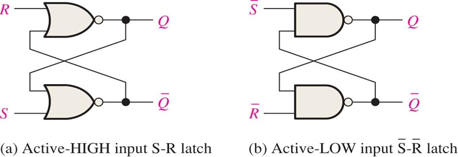
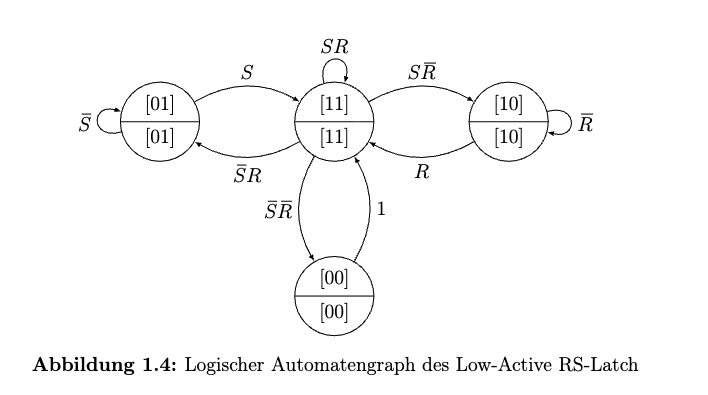
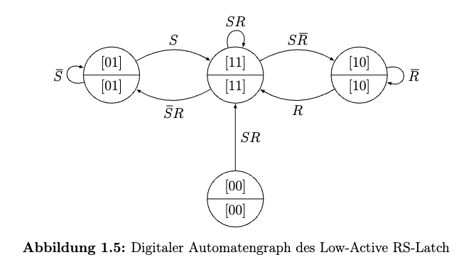

## Aufgabe 1.1: Low-Active SR-Latch

### a. Schaltungsstruktur

* High-Active: $R \ S$-based, NOR-based
* LOW-Active: $\overline{S} \ \overline{R}-$based, NAND-based
***

### b. vereinfachtete Schaltfolgetabelle
+ High-Active RS-Latch
  
    | R | S | $Q_{\text{next}}$ | $\overline{Q}_{\text{next}}$  | State   |
    | - | - | -------- | --------- | ------- |
    | 0 | 0 | $Q_{\text{prev}}$ | $\overline{Q}_{\text{prev}}$ | Hold    |
    | $\textcolor{red}{1}$ | 0 | 0        | 1         | Reset   |
    | 0 | $\textcolor{red}{1}$ | 1        | 0         | Set     |
    | 1 | 1 | 0  | 0   | Invalid, forbidden |

+ Low-Active SR-Latch

    | S | R | $\overline{S}$ | $\overline{R}$ | $Q_{\text{next}}$ | $\overline{Q}_{\text{next}}$ | State   |
    | - | - | -------------- | -------------- | ---------------- | -------------------------- | ------- |
    | 0 | 0 | 1              | 1              | $Q_{\text{prev}}$ | $\overline{Q}_{\text{prev}}$ | Hold    |
    | 0 | 1 | 1              | $\textcolor{red}{0}$              | 0                | 1                          | Reset   |
    | 1 | 0 | $\textcolor{red}{0}$              | 1              | 1                | 0                          | Set     |
    | 1 | 1 | 0              | 0              | 1                | 1                          | Invalid, forbidden |
***

### c. Interpretationsmöglichkeiten
+ Logische Ebene 
  + Rein Mathmathik, Zero Delay 
  + Jede Kombination aus Input führt zu einem Folgezustand.
  + Der Zustand $\overline{S} \ \overline{R} = 00$ erzeugt einem Ausgangszustand $Q \ \overline{Q} = 11$, erlaubt in logische Ebene
  
+ Digital Ebene 
  + Delays hängt von Fertigungstoleranz, Temperatur und Stromversorgungsrauschen ab. 
  + Bei Eingabezustand $\overline{S} \ \overline{R} = 00$ $\Longrightarrow$ $Q \ \overline{Q} = 11$
  + Digital illegal, $Q$ und $\overline{Q}$ nicht komplementär.
  + Sobald man die Eingänge wieder freigibt ($\overline{S} = 1$ und $\overline{R} = 1$)
  + Wenn die Delays der beiden NAND nahezu identisch sind:
    Beide Ausgänge fallen gleichzeitig von 1 auf 0.
    Beide Ausgänge versuchen gleichzeitig wieder auf 1 zurückzukehren.
    Beide Ausgangsspannungen bleiben bei $V_{dd}/2$, metastabiler Zustand.
    Nach einigen $\mathrm{ns}-$ oder $ps-$Zeit (abhängig vom Rauschen) ist das Delay nicht mehr symmetrisch.
    Race entsteht, Endzustand hängt vom Delay der NANDs ab.

+ Analog Ebene
  + Betrachtet kontinuierliche Spannungen, Laufzeiten und Rauschen.
  + Metastabilen Zustand erzeugt.
  + Mit SPICE-Simulation bekommen wir eine vollständig deterministische kontinuierliche Spannungskurve. (Prak.EIS2)
  + Die Kurve wird durch reale physikalische Parameter bestimmt.

--- 
## Aufgabe 1.2: Zustandsüberführungen
### a. Logische Wertetabelle des Low-Active RS-Latch
+ Die logische Gleichungen (z-Gleichungen):
  + ${^{n}}Q_{1} = \neg (\overline{S} \land {^{a}}Q_{0}) = {^{a}}\overline{Q_{0}} \ \lor S$
  + ${^{n}}Q_{0} = \neg (\overline{R} \land {^{a}}Q_{1}) = {^{a}}\overline{Q_{1}} \ \lor R$

    | ${^{a}}Q_{1}$ | ${^{a}}Q_{0}$ |$S$ | $R$ | ${^{n}}Q_{1}$ | ${^{n}}Q_{0}$ |
    |-----|-----|----|----|------------------|------------------|
    | 0 | 0 | 0 | 0 | $1$ | $1$ |
    | 0 | 0 | 0 | 1 | $1$ | $1$ |
    | 0 | 0 | 1 | 0 | $1$ | $1$ |
    | 0 | 0 | 1 | 1 | $1$ | $1$ |
    | **---** | **---** | **---** | **---** | **---** | **---** |
    | 0 | 1 | 0 | 0 | $0$ | $1$ |
    | 0 | 1 | 0 | 1 | $0$ | $1$ |
    | 0 | 1 | 1 | 0 | $1$ | $1$ |
    | 0 | 1 | 1 | 1 | $1$ | $1$ |
    | **---** | **---** | **---** | **---** | **---** | **---** |
    | 1 | 0 | 0 | 0 | $1$ | $0$ |
    | 1 | 0 | 0 | 1 | $1$ | $1$ |
    | 1 | 0 | 1 | 0 | $1$ | $0$ |
    | 1 | 0 | 1 | 1 | $1$ | $1$ |
    | **---** | **---** | **---** | **---** | **---** | **---** |
    | 1 | 1 | 0 | 0 | $0$ | $0$ |
    | 1 | 1 | 0 | 1 | $0$ | $1$ |
    | 1 | 1 | 1 | 0 | $1$ | $0$ |
    | 1 | 1 | 1 | 1 | $1$ | $1$ |

***

### b. Digitale Wertetabelle des Low-Active RS-Latch
+ Die logische Gleichungen (z-Gleichungen):
  + ${^{n}}Q_{1} = \neg (\overline{S} \land {^{a}}Q_{0}) = {^{a}}\overline{Q_{0}} \ \lor S$
  + ${^{n}}Q_{0} = \neg (\overline{R} \land {^{a}}Q_{1}) = {^{a}}\overline{Q_{1}} \ \lor R$

    | ${^{a}}Q_{1}$ | ${^{a}}Q_{0}$ |$S$ | $R$ | ${^{n}}Q_{1}$ | ${^{n}}Q_{0}$ | Kommentar |
    |-----|-----|----|----|------------------|------------------|-------|
    | 0 | 0 | 0 | 0 | $*$ | $*$ | Race, Meta-Zustand|
    | 0 | 0 | 0 | 1 | $*$ | $1$ | Meta-Zustand |
    | 0 | 0 | 1 | 0 | $1$ | $*$ | Meta-Zustand | 
    | 0 | 0 | 1 | 1 | $1$ | $1$ | stabiler Zustand |
    | **---** | **---** | **---** | **---** | **---** | **---** | **-------------------** |
    | 0 | 1 | 0 | 0 | $0$ | $1$ | stabiler Zustand |
    | 0 | 1 | 0 | 1 | $0$ | $1$ | stabiler Zustand|
    | 0 | 1 | 1 | 0 | $1$ | $1 \to 0$ | transienter Zustand |
    | 0 | 1 | 1 | 1 | $1$ | $1$ | stabiler Zutstand |
    | **---** | **---** | **---** | **---** | **---** | **---** | **-------------------** |
    | 1 | 0 | 0 | 0 | $1$ | $0$ | stabiler Zustand | 
    | 1 | 0 | 0 | 1 | $1 \to 0$ | $1$ | transienter Zustand |
    | 1 | 0 | 1 | 0 | $1$ | $0$ | stabiler Zustand|
    | 1 | 0 | 1 | 1 | $1$ | $1$ | stabiler Zustand |
    | **---** | **---** | **---** | **---** | **---** | **---** | **-------------------** |
    | 1 | 1 | 0 | 0 | $*$ | $*$ | Race, Meta-Zustand |
    | 1 | 1 | 0 | 1 | $0$ | $1$ | stabiler Zustand |
    | 1 | 1 | 1 | 0 | $1$ | $0$ | stabiler Zustand |
    | 1 | 1 | 1 | 1 | $1$ | $1$ | stabiler Zustand |

***

### c. Schrumpe/Ternärvektorliste(TVL) der digitalen $\Delta$ (Zustandsüberführungsmenge)
**$\Delta$ ist die Vereinigung alle Vektoren, für die eine legale Übertragung besteht. (12 insgesamt)**
$$
\Delta = [001111] \ \lor [010011] \ \lor [010101] \ \lor [011011] \ \lor [011111] 
\lor [100010] \\ \lor [100111] \lor [101010] \lor [101111] \lor [110101] \lor [111010] \lor [111111]$$

***

## Aufgabe 1.3 Automaten
### a. Logischer Automatengraph des Low-Active RS-Latch

+ Bekommt von Logische Wertetabelle
+ 4 Endzustände ($Q_1Q_0 = [00, 01, 10, 11]$) in Kreis
+ Übergangsbedingung sind Pfeile (1 bedeutet egal was)

***

### b. Digitaler Automatengraph des Low-Active RS-Latch

***

### c. z-Gleichungen 
+ ${^{n}}Q_{1} = \neg (\overline{S} \land {^{a}}Q_{0}) = {^{a}}\overline{Q_{0}} \ \lor S$
+ ${^{n}}Q_{0} = \neg (\overline{R} \land {^{a}}Q_{1}) = {^{a}}\overline{Q_{1}} \ \lor R$
+ Vereinfachen: $$(Q_1, Q_0) = (\overline{Q_0} \lor S, \overline{Q_1} \lor R)$$
***

### d. Zustandsgleichungen des logischen Automaten
+ 4 Zustände defineren:
  + $k_0(z) = (Q_1=0, Q_0=0) = 00$
  + $k_1(z) = (Q_1=0, Q_0=1) = 01$
  + $k_2(z) = (Q_1=1, Q_0=0) = 10$
  + $k_3(z) = (Q_1=1, Q_0=1) = 11$

+ Von der logischen Wertetabelle mithilfe KV-Map oder BAA
  + $k_0(z) = Q_1Q_0\overline{S} \ \overline{R}$
  + $k_1(z) = \overline{Q_1}Q_0\overline{S} \ \lor Q_0 \overline{S} R$
  + $k_2(z) = Q_1S\overline{R} \ \lor Q_1 \ \overline{Q_0}  \overline{R}$
  + $k_3(z) = (\overline{Q_0} \lor S) \land (\overline{Q_1} \lor R) = \overline{Q_1} \ \overline{Q_0} \lor \overline{Q_0} R \ \lor \overline{Q_1}S \ \lor SR$

***

## Aufgabe 1.4: Digitaler Partieller Automat 
### a. Die $*$-Zustandsgleichung:

$$
    * = 
    \begin{bmatrix}
    0 & 0 & 0 & 0 \\
    0 & 0 & 0 & 1 \\
    0 & 0 & 1 & 0 \\
    1 & 1 & 0 & 0
    \end{bmatrix}
    =
    \begin{bmatrix}
    0 & 0 & 0 & - \\
    0 & 0 & - & 0 \\
    1 & 1 & 0 & 0
    \end{bmatrix}
    =
    \overline{Q_1}\,\overline{Q_0}\,\overline{S}\,
    \;\vee\;
    \overline{Q_1}\,\overline{Q_0}\,\overline{R}\,
    \;\vee\;
    Q_1 Q_0\,\overline{S}\,\overline{R}
$$

***

### b. Logischer Automat nach digitalen Automat abziehen mithilfe von $\land \, \overline{*}$

**Verundungsregeln ($\land$)**

| $\land$ | 0 | 1 | - | 
|-----|-----|----|----|
| 0 | 0 | x | 0 | 
| 1 | x | 1 | 1 | 
| - | 0 | 1 | - | 
 
**Matrix von $\overline{*}$ mithilfe von KV-Map**

$$
    \overline{*} = 
    \begin{bmatrix}
    0 & 1 & - & - \\
    1 & 0 & - & - \\
    1 & - & 1 & - \\
    - & - & 1 & 1 \\ 
    1 & - & - & 1
    \end{bmatrix}
$$

**$k_0(z)^d = k_0(z)^l \land \overline{*}$**

$$
    k_0(z)^d = \begin{bmatrix}
    1 & 1 & 0 & 0
    \end{bmatrix} \land
    \begin{bmatrix}
    0 & 1 & - & - \\
    1 & 0 & - & - \\
    1 & - & 1 & - \\
    - & - & 1 & 1 \\ 
    1 & - & - & 1
    \end{bmatrix} 
    = 0
$$

**$k_1(z)^d = k_1(z)^l \land \overline{*}$**

$$
    k_1(z)^d = \begin{bmatrix}
    0 & 1 & 0 & - \\
    - & 1 & 0 & 1
    \end{bmatrix} \land
    \begin{bmatrix}
    0 & 1 & - & - \\
    1 & 0 & - & - \\
    1 & - & 1 & - \\
    - & - & 1 & 1 \\ 
    1 & - & - & 1
    \end{bmatrix} 
    = 
    \begin{bmatrix}
    0 & 1 & 0 & - \\
    0 & 1 & 0 & 1 \\ 
    1 & 1 & 0 & 1 
    \end{bmatrix}
    = 
    \begin{bmatrix}
    0 & 1 & 0 & - \\
    - & 1 & 0 & 1 
    \end{bmatrix}
$$

**$k_2(z)^d = k_2(z)^l \land \overline{*}$**

$$
    k_2(z)^d = \begin{bmatrix}
    1 & 0 & - & 0 \\
    1 & - & 1 & 0
    \end{bmatrix} \land
    \begin{bmatrix}
    0 & 1 & - & - \\
    1 & 0 & - & - \\
    1 & - & 1 & - \\
    - & - & 1 & 1 \\ 
    1 & - & - & 1
    \end{bmatrix} 
    = 
    \begin{bmatrix}
    1 & 0 & - & 0 \\
    1 & 0 & 1 & 0 \\
    1 & 0 & 1 & 0 \\ 
    1 & - & 1 & 0  
    \end{bmatrix}
    = 
    \begin{bmatrix}
    1 & 0 & - & 0 \\
    1 & - & 1 & 0 
    \end{bmatrix}
$$

**$k_3(z)^d = k_3(z)^l \land \overline{*}$**

$$
    k_3(z)^d = \begin{bmatrix}
    \textcolor{red}{0} & \textcolor{red}{0} & \textcolor{red}{-} & \textcolor{red}{-} \\
    \textcolor{blue}{-} & \textcolor{blue}{0} & \textcolor{blue}{-} & \textcolor{blue}{1} \\
    \textcolor{green}{0} & \textcolor{green}{-} & \textcolor{green}{1} & \textcolor{green}{-} \\
    \textcolor{pink}{-} & \textcolor{pink}{-} & \textcolor{pink}{1} & \textcolor{pink}{1}   
    \end{bmatrix} \land
    \begin{bmatrix}
    0 & 1 & - & - \\
    1 & 0 & - & - \\
    1 & - & 1 & - \\
    - & - & 1 & 1 \\ 
    1 & - & - & 1
    \end{bmatrix} 
    = 
    \begin{bmatrix}
    \textcolor{red}{0} & \textcolor{red}{0} & \textcolor{red}{1} & \textcolor{red}{1} \\
    \textcolor{blue}{1} & \textcolor{blue}{0} & \textcolor{blue}{-} & \textcolor{blue}{1} \\
    \textcolor{blue}{1} & \textcolor{blue}{0} & \textcolor{blue}{1} & \textcolor{blue}{1} \\ 
    \textcolor{blue}{-} & \textcolor{blue}{0} & \textcolor{blue}{1} & \textcolor{blue}{1} \\ 
    \textcolor{blue}{1} & \textcolor{blue}{0} & \textcolor{blue}{-} & \textcolor{blue}{1} \\ 
    \textcolor{green}{0} & \textcolor{green}{1} & \textcolor{green}{1} & \textcolor{green}{-} \\ 
    \textcolor{green}{0} & \textcolor{green}{-} & \textcolor{green}{1} & \textcolor{green}{1} \\ 
    \textcolor{pink}{0} & \textcolor{pink}{1} & \textcolor{pink}{1} & \textcolor{pink}{1} \\ 
    \textcolor{pink}{1} & \textcolor{pink}{0} & \textcolor{pink}{1} & \textcolor{pink}{1} \\ 
    \textcolor{pink}{1} & \textcolor{pink}{-} & \textcolor{pink}{1} & \textcolor{pink}{1} \\ 
    \textcolor{pink}{-} & \textcolor{pink}{-} & \textcolor{pink}{1} & \textcolor{pink}{1} \\ 
    \textcolor{pink}{1} & \textcolor{pink}{-} & \textcolor{pink}{1} & \textcolor{pink}{1}
    \end{bmatrix}
    = 
    \begin{bmatrix}
    \textcolor{blue}{1} & \textcolor{blue}{0} & \textcolor{blue}{-} & \textcolor{blue}{1} \\
    \textcolor{green}{0} & \textcolor{green}{1} & \textcolor{green}{1} & \textcolor{green}{-} \\ 
    \textcolor{pink}{-} & \textcolor{pink}{-} & \textcolor{pink}{1} & \textcolor{pink}{1}
    \end{bmatrix}
$$

***
### c. Superponieren alle Zustände zu einer TVL
**Der digitale Automatengraph $AG(t)$ mit $t = ({^{a}}\overline{Q_{1}}, {^{a}}\overline{Q_{0}}, S, R, {^{n}}\overline{Q_{1}}, {^{n}}\overline{Q_{0}})$**
Von Schaltfolgetabelle auslesen.
$$
    AG(t) = 
    \begin{bmatrix}
    0 & 1 & 0 & - & 0 & 1 \\
    - & 1 & 0 & 1 & 0 & 1 \\
    1 & 0 & - & 0 & 1 & 0 \\
    1 & - & 1 & 0 & 1 & 0 \\
    1 & 0 & - & 1 & 1 & 1 \\
    0 & 1 & 1 & - & 1 & 1 \\
    - & - & 1 & 1 & 1 & 1 
    \end{bmatrix} 
$$

***

### d. Die z-Gleichungen $(Q_0, \overline{Q_0})$ und $(Q_1, \overline{Q_1})$
**Alle Input Kombinationen für $Q_0 = 1$ in digitalen Schaltfolgetabelle auflisten**

$$
    Q_0 = 
    \begin{bmatrix}
    0 & 0 & 1 & 1 \\
    0 & 1 & 0 & 0 \\
    0 & 1 & 0 & 1 \\
    0 & 1 & 1 & 0 \\ 
    0 & 1 & 1 & 1 \\
    1 & 0 & 0 & 1 \\
    1 & 0 & 1 & 1 \\
    1 & 1 & 0 & 1 \\ 
    1 & 1 & 1 & 1 
    \end{bmatrix} 
    = 
    \begin{bmatrix}
    0 & 1 & - & - \\
    - & - & 1 & 1 \\
    1 & - & - & 1 
    \end{bmatrix} 
$$

**Alle Input Kombinationen für $Q_0 = 0$ in digitalen Schltfolgetabelle auflisten**

$$
    \overline{Q_0} = 
    \begin{bmatrix}
    1 & 0 & 0 & 0 \\
    1 & 0 & 1 & 0 \\
    1 & 1 & 1 & 0 
    \end{bmatrix} =
    \begin{bmatrix}
    1 & 0 & - & 0 \\
    1 & - & 1 & 0 
    \end{bmatrix} 
$$

$$
 (Q_0, \overline{Q_0}) := \left(\begin{bmatrix}
    0 & 1 & - & - \\
    - & - & 1 & 1 \\
    1 & - & - & 1 
    \end{bmatrix} ,
    \begin{bmatrix}
    1 & 0 & - & 0 \\
    1 & - & 1 & 0 
    \end{bmatrix} 
    \right) 
$$

**Im Gleichfall für $(Q_1, \overline{Q_1})$**

$$
 (Q_1, \overline{Q_1}) := 
    \left(
    \begin{bmatrix}
    0 & 0 & 1 & 1 \\
    0 & 1 & 1 & 0 \\
    0 & 1 & 1 & 1 \\
    1 & 0 & 0 & 0 \\ 
    1 & 0 & 0 & 1 \\
    1 & 0 & 1 & 0 \\
    1 & 0 & 1 & 1 \\
    1 & 1 & 1 & 0 \\ 
    1 & 1 & 1 & 1 
    \end{bmatrix}, 
    \begin{bmatrix}
    0 & 1 & 0 & 0 \\
    0 & 1 & 0 & 1 \\
    1 & 1 & 0 & 1 
    \end{bmatrix} 
    \right) = 
    \left(\begin{bmatrix}
    1 & 0 & - & - \\
    - & - & 1 & 1 \\
    - & 1 & 1 & - 
    \end{bmatrix} ,
    \begin{bmatrix}
    0 & 1 & 0 & - \\
    - & 1 & 0 & 1 
    \end{bmatrix} 
    \right) 
$$

***
### e. Die Zustandsgleichungen $k(z) = (k_3, k_2, k_1, k_0)$

$$
    k(z) = (k_3, k_2, k_1, k_0)(z)
    = \left( 
    \begin{bmatrix}
    1 & 0 & - & 1 \\
    - & - & 1 & 1 \\ 
    0 & 1 & 1 & -  
    \end{bmatrix},
    \begin{bmatrix}
    1 & 0 & - & 0 \\
    1 & - & 1 & 0 
    \end{bmatrix},
    \begin{bmatrix}
    0 & 1 & 0 & - \\
    - & 1 & 0 & 1 
    \end{bmatrix},
    0 
    \right)
$$

***
### f. Die Schaltungsstruktur 
**An die Schwarztafel**
