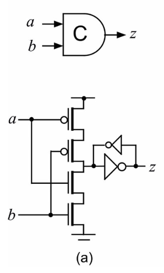
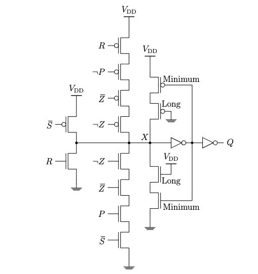
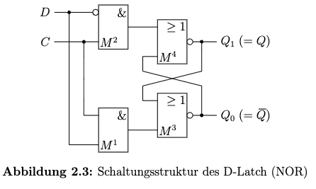
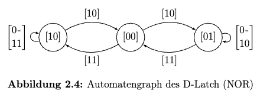
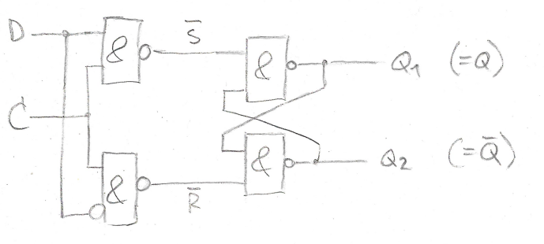
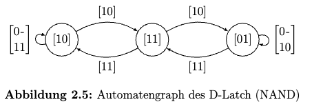
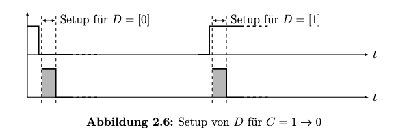
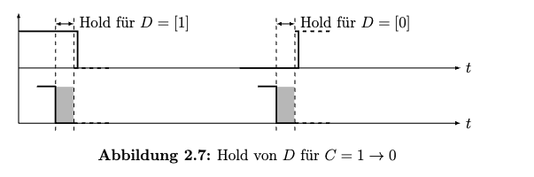

## Aufgabe 2.1: RS-Buffer (Muller C-element)
### a. Muller C-element

| a | b | z | 
| - | - | - |
| 0 | 0 | 0 |
| 0 | 1 | $z_{prev}$  | 
| 1 | 0 | $z_{prev}$  |
| 1 | 1 | 1 |

### b. der programmierbare RS-Buffer

| $\overline{S}$ | $R$ | $X$ | $Q$ | Kommentar | 
| - | - | - | - | - | 
| 0 | 0 | 1 | 1 | Reset auf HIGH |
| 0 | 1 | * | * | Kurzschluss | 
| 1 | 0 | ? | ? | hängt ab von Steuersignalen | 
| 1 | 1 | 0 | 0 | Reset auf LOW | 

+ Transistors mit Min & Long Kanallänge bauen Keeper auf.

***

## Aufgabe 2.2: D-Latch mit NOR 

### a. Wertetabelle 

+ High-Active RS-Latch (NOR)
  
    | R | S | $Q_{\text{next}}$ | $\overline{Q}_{\text{next}}$  | State   |
    | - | - | -------- | --------- | ------- |
    | 0 | 0 | $Q_{\text{prev}}$ | $\overline{Q}_{\text{prev}}$ | Hold    |
    | $\textcolor{red}{1}$ | 0 | 0        | 1         | Reset   |
    | 0 | $\textcolor{red}{1}$ | 1        | 0         | Set     |
    | 1 | 1 | 0  | 0   | Invalid, forbidden |

+ DC-AND-Gatters
    | D | C | R | S | 
    | - | - | - | - |
    | 0 | 0 | 0 | 0 |
    | 0 | 1 | 1 | 0 |
    | 1 | 0 | 0 | 0 |
    | 1 | 1 | 0 | 1 |

+ If C = 0, store state 
+ If C = 1, Q = D
+ $\Longrightarrow$ zustandsgesteuerter D-Latch

### b. zuverlässig?
+ DC = 11 $\Longrightarrow$ (R, S, ${^{a}}Q_{1}$, ${^{a}}Q_{0}$) = (0, 1, 0, 1) 
+ $\Longrightarrow$ transienten Zustand (${^{n}}Q_{1}$, ${^{n}}Q_{0}$) = (0, 0)
+ Wenn $C = 1 \rightarrow 0$ in diesen Zeitraum (R, S, ${^{a}}Q_{1}$, ${^{a}}Q_{0}$) = (0, 0, 0, 0)
+ $\Longrightarrow$ race

### c. Automatengraph 

+ 3 Endzustände $Q_1Q_0$ = 10, 00(transient), 01
+ Zwei Fehlern?

***
## Aufgabe 2.3: D-Latch mit NAND 

### a. Wertetabelle 

+ Low-Active SR-Latch (NAND)

    | S | R | $\overline{S}$ | $\overline{R}$ | $Q_{\text{next}}$ | $\overline{Q}_{\text{next}}$ | State   |
    | - | - | -------------- | -------------- | ---------------- | -------------------------- | ------- |
    | 0 | 0 | 1              | 1              | $Q_{\text{prev}}$ | $\overline{Q}_{\text{prev}}$ | Hold    |
    | 0 | 1 | 1              | $\textcolor{red}{0}$              | 0                | 1                          | Reset   |
    | 1 | 0 | $\textcolor{red}{0}$              | 1              | 1                | 0                          | Set     |
    | 1 | 1 | 0              | 0              | 1                | 1                          | Invalid, forbidden |

+ DC-NAND Gatters
    | D | C | $\overline{S}$ | $\overline{R}$ | 
    | - | - | - | - |
    | 0 | 0 | 1 | 1 |
    | 0 | 1 | 1 | 0 |
    | 1 | 0 | 1 | 1 |
    | 1 | 1 | 0 | 1 |

+ If C = 0, store state 
+ If C = 1, Q = D
+ $\Longrightarrow$ zustandsgesteuerter D-Latch

### b. zuverlässig?
+ DC = 01 $\Longrightarrow$ ($\overline{S}$, $\overline{R}$, ${^{a}}Q_{1}$, ${^{a}}Q_{0}$) = (1, 0, 1, 0) 
+ $\Longrightarrow$ transienten Zustand (${^{n}}Q_{1}$, ${^{n}}Q_{0}$) = (1, 1)
+ Wenn $C = 1 \rightarrow 0$ in diesen Zeitraum ($\overline{S}$, $\overline{R}$, ${^{a}}Q_{1}$, ${^{a}}Q_{0}$) = (1, 1, 1, 1)
+ $\Longrightarrow$ race

### c. Automatengraph 

+ Zwei Fehlern?

### d. Setup & Hold
+ Um Race zu vermeiden, D muss halten wenn C umschaltet
+ Setup: Die kürzeste Zeit, die D vor der fallenden Flanken von C stabil bleiben muss.

+ Hold: Die maximale Zeit, während der D nach der fallenden Flanken von C stabil bleiben muss.

## Aufgabe 2.4. Realisierung des D-Latch mit NAND-Gattern
+ Klausur irrelevant
