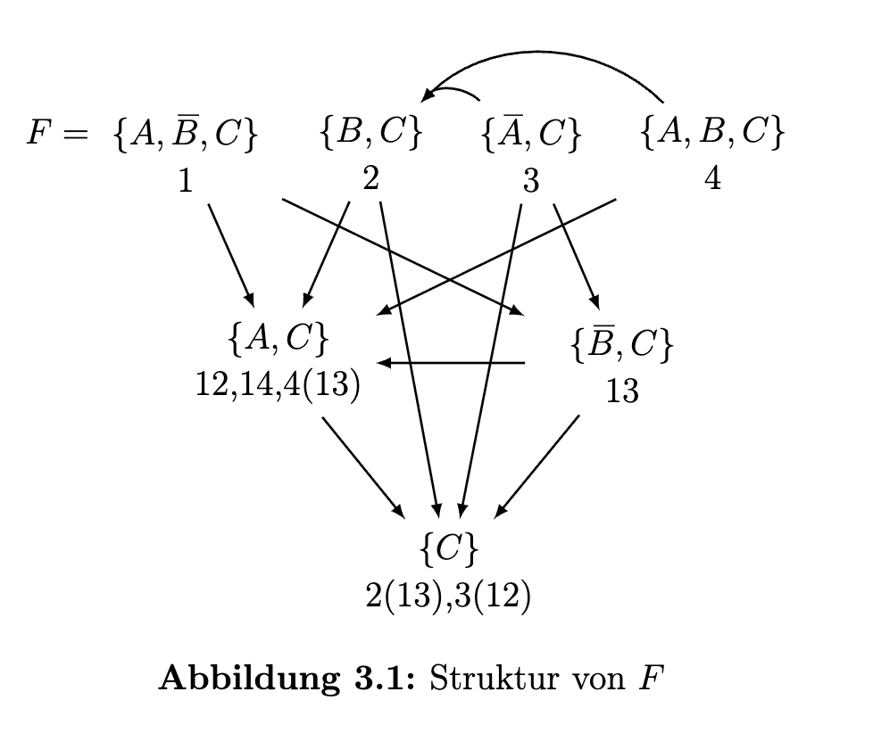
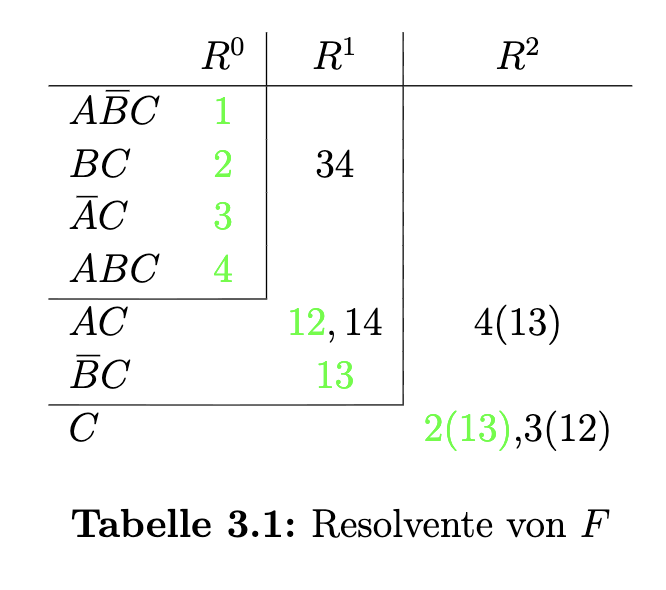
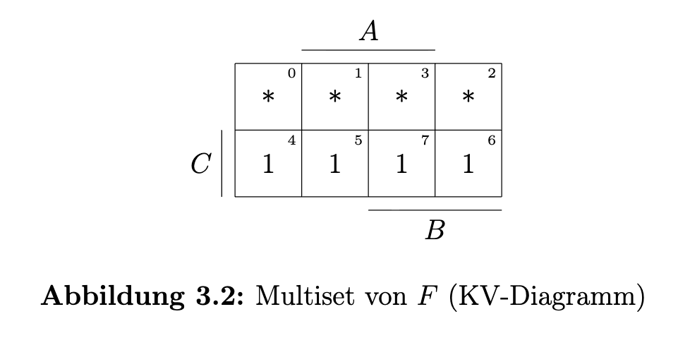
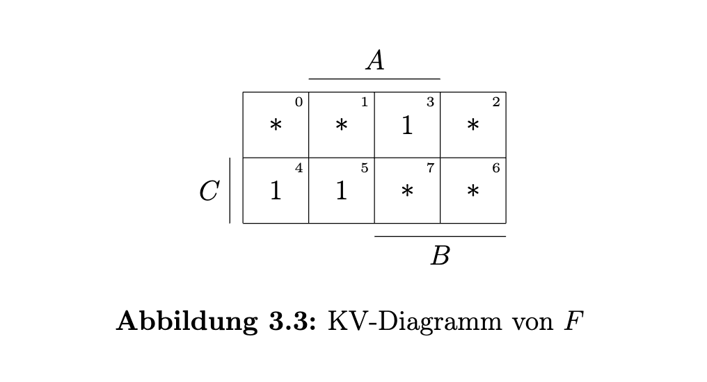
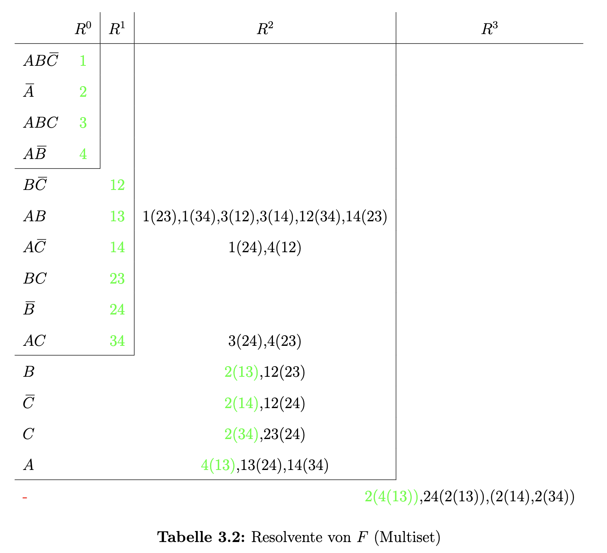
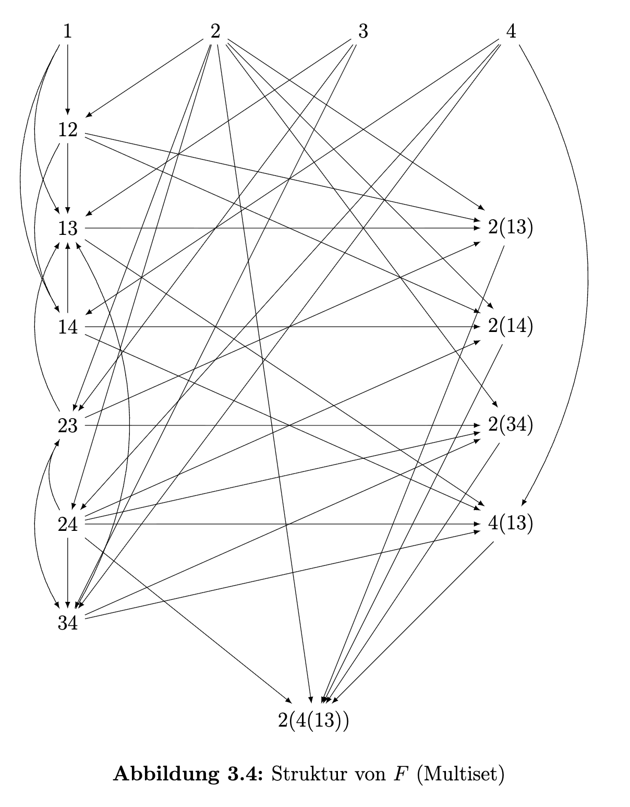
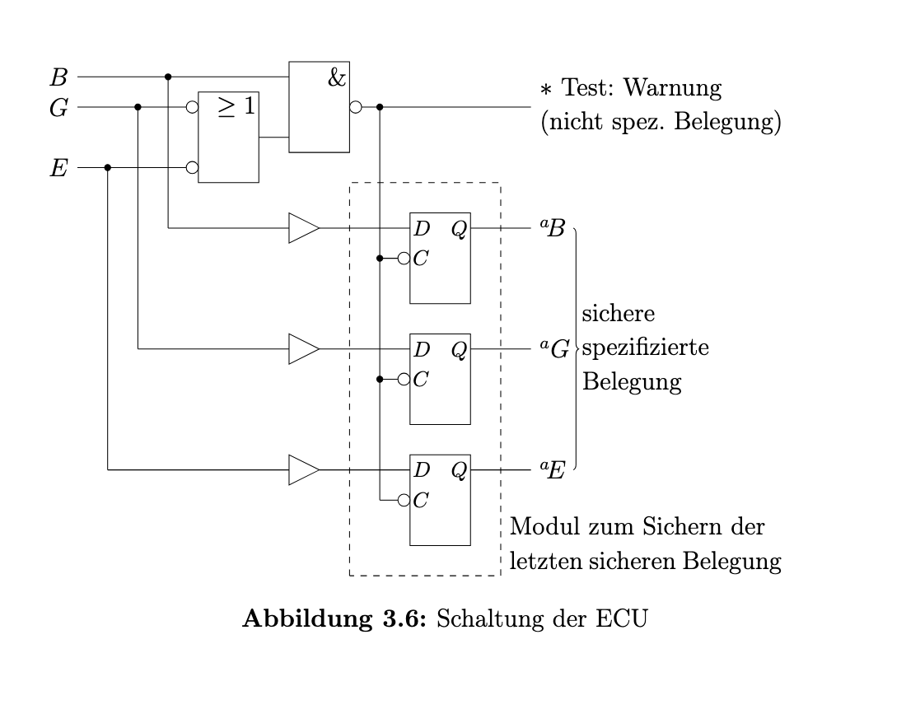

## Aufgabe 3.1: Resolvente 
### a. Klauselmenge F

$$F=\{\{A,\overline{B},C\},\{B,C\},\{\overline{A},C\},\{A,B,C\}\}$$

+ Jede Klausel selbst bedeutet $\land$, z.B. $\{A,\overline{B},C\} \Rightarrow A \land \overline{B} \land C, \ A \overline{B}C$
+ Klauseln miteinander mit $\lor$ verknüpft, z.B. $\{\{A,\overline{B},C\},\{B,C\}\} \Rightarrow A \overline{B}C \ \lor BC$

### b. Grundidee der Resolvente

+ Wenn zwei Klauseln **exakt nur ein** komplementäres Literal-Paar haben, dann kann man es eliminieren und die restlichen kombinieren.
  + z.B. $\{\{A,\overline{B},C\},\{B,C\}\} \Rightarrow  \{\{A,C\}\}$

+ Kurz sagen: gemeinsame Teile finden und Klauseln vereinfachen

**Resolvente-Regeln ($\lor$)**

| $\lor$ | 0 | 1 | - | 
|-----|-----|----|----|
| 0 | 0 | - | 0 | 
| 1 | - | 1 | 1 | 
| - | 0 | 1 | - | 

### c. Struktur von F 

+ Jede Klausel nummerieren
+ Alle möglichen Resolvente zeigen 

### d. Resolvente in Tabelle Form

### e. $F_{\text{min}}$ als DNF 

$$F_{\text{min}} = A \overline{B}C \ \lor BC \ \lor \overline{A}C \ \lor ABC \\ = AC \ \lor \overline{A}C \ \lor ABC \\ = C \ \lor ABC \\ = C$$

* Absorption Law für $C \ \lor ABC$

### f. Überprüfung mit KV-Diagramm

---

## Aufgabe 3.2: Klauselmenge 

### a. Klauselmenge 
+ Interpretation von F als KNF:
  $$F_{\text{KNF}} = \{\{A,C\},\{\overline{A},B,C\},\{\overline{B},\overline{C}\}\}$$

+ Interpretation von F als DNF:
  
| A | B | C | $A \lor C$ | $\overline{A} \lor B \lor C$ | $\overline{B} \lor \overline{C}$ | F |
|-----|-----|----|----|-----|-----|----|
| 0 | 0 | 0 | 0 | 1 | 1 | 0 | 
| 0 | 0 | 1 | 1 | 1 | 1 | 1 | 
| 0 | 1 | 0 | 0 | 1 | 1 | 0 |
| 0 | 1 | 1 | 1 | 1 | 0 | 0 |  
| 1 | 0 | 0 | 1 | 0 | 1 | 0 |
| 1 | 0 | 1 | 1 | 1 | 1 | 1 | 
| 1 | 1 | 0 | 1 | 1 | 1 | 1 | 
| 1 | 1 | 1 | 1 | 1 | 0 | 0 |

+ $$F_{\text{DNF}} = \{\{\overline{A}, \overline{B}, C\},\{A, \overline{B},C\},\{A, B,\overline{C}\}\}$$

### b. 1-Menge 

+ alle Belegungen von $A$, $B$, $C$, bei denen $F$ wahr wird.
+ $$\text{1-Menge} = F_{\text{DNF}} = \{\{\overline{A}, \overline{B}, C\},\{A, \overline{B},C\},\{A, B,\overline{C}\}\}$$
+ Im KV-Diagramm visualisieren

---

## Aufgabe 3.3 : Struktur 

### a. Resolvente 

### c. Struktur 

### c. Erfüllbarkeit und Gültigkeit

+ Interpretation von F als DNF, Symbol $(-)$, die Klauselmenge F ist erfüllbar und gültig.
+ Interpretation von F als KNF, keine 1-Menge, Leermenge, F ist nicht erfüllbar und gültig 

| A | B | C | $A \lor B \lor \overline{C}$ | $\overline{A}$ |$A \lor B \lor C$ | $A \lor \overline{B}$ | F |
|-----|-----|----|----|-----|-----|----|----|
| 0 | 0 | 0 | 1 | 1 | 0 | 1 | 0
| 0 | 0 | 1 | 0 | 1 | 1 | 1 | 0
| 0 | 1 | 0 | 1 | 1 | 1 | 0 | 0
| 0 | 1 | 1 | 1 | 1 | 1 | 0 | 0 
| 1 | 0 | 0 | 1 | 0 | 1 | 1 | 0
| 1 | 0 | 1 | 1 | 0 | 1 | 1 | 0
| 1 | 1 | 0 | 1 | 0 | 1 | 1 | 0
| 1 | 1 | 1 | 1 | 0 | 1 | 1 | 0

---

## Aufgabe 3.4: Electronic Control Unit 

### a. Variablen definieren 
+ B $\iff$ Batterieinformation verfügbar (B = 1)
+ E $\iff$ maximaler Energieverbrauch freigegeben (E = 1)
+ G $\iff$ hohe Geschwindigkeit (G = 1)

### b. Designregeln in Aussagenlogik 
+ Wenn keine Batterieinformation **$(\overline{B})$** verfügbar ist, muss der maximale Energieverbrauch **$(E)$** freigegeben sein
  + $\overline{B} \Rightarrow E = (B\vee E) = \vee(B,E) = \{B,E\}$
  
+ Wenn Batterieinformation **$(B)$** verfügbar  **und** maximaler Energieverbrauch **$(E)$** freigegeben, darf das System nicht in hoher Geschwindigkeit **$(\overline{G})$** betrieben werden.
  + $(B\wedge E\Rightarrow\overline{G})$ = $(\overline{B \land E}\vee\overline{G})$ = $(\overline{B}\vee\overline{E}\vee\overline{G}) = \lor(\overline{B}, \overline{E}, \overline{G}) = \{\overline{B}, \overline{E}, \overline{G}\}$
  
+  Wenn hohe Geschwindigkeit  **$(G)$** **oder**  keine Batterieinformation **$(\overline{B})$**, darf maximaler Energieverbrauch nicht **$(\overline{E})$** freigegeben sein
   +  $G \ \vee \overline{B} \Rightarrow \overline{E}$
   +  Das sind eigentlich zwei Regeln:
      + $G \Rightarrow \overline{E} = (\overline{G} \lor \overline{E}) = \vee(\overline{G}, \overline{E}) = \{\overline{G}, \overline{E}\}$
      + $\overline{B} \Rightarrow \overline{E} = (B \lor \overline{E}) = \vee(B, \overline{E}) = \{B, \overline{E}\}$

### c. Gesamte Klauselmenge
+ $F_{\text{KNF}} = \{\{B, E\},\ \{\bar{B}, \bar{E}, \bar{G}\},\ \{\bar{G}, \bar{E}\},\ \{B, \bar{E}\}\}$

### d. 1-Menge/ 1-Überdeckung mit Wertetabelle
+ Klauselmenge in KNF, so Resolvente geht nicht 

| B | E | G | $B \lor E$ | $\overline{B} \lor \overline{E} \lor \overline{G}$ |$\overline{G} \lor \overline{E}$ | $B \lor \overline{E}$ | F |
|-----|-----|----|----|-----|-----|----|----|
| 0 | 0 | 0 | 0 | 1 | 1 | 1 | 0
| 0 | 0 | 1 | 0 | 1 | 1 | 1 | 0
| 0 | 1 | 0 | 1 | 1 | 1 | 0 | 0
| 0 | 1 | 1 | 1 | 1 | 0 | 0 | 0 
| 1 | 0 | 0 | 1 | 1 | 1 | 1 | 1
| 1 | 0 | 1 | 1 | 1 | 1 | 1 | 1
| 1 | 1 | 0 | 1 | 1 | 1 | 1 | 1
| 1 | 1 | 1 | 1 | 0 | 0 | 1 | 0

+ $F = B\overline{E} \ \lor B\overline{G}  = B \land (\overline{E} \lor  \overline{G}) = \land(B, \lor(\overline{E}, \overline{G})) = \{\{B\}, \{\overline{E}, \overline{G}\}\}$

### e. Schaltung von ECU

