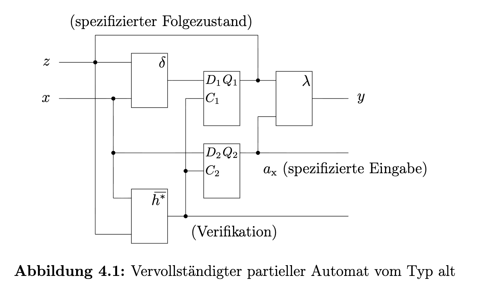
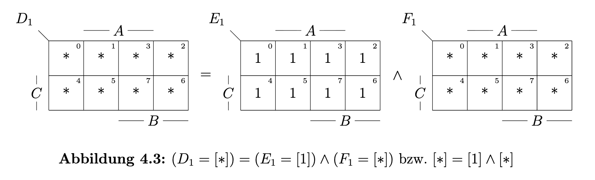
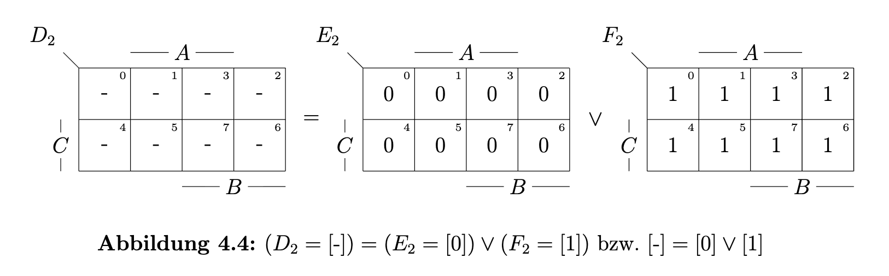
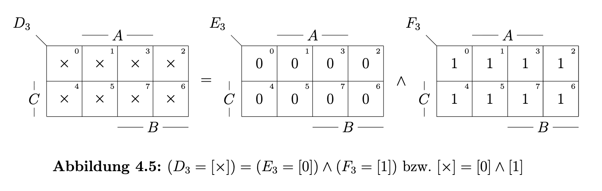
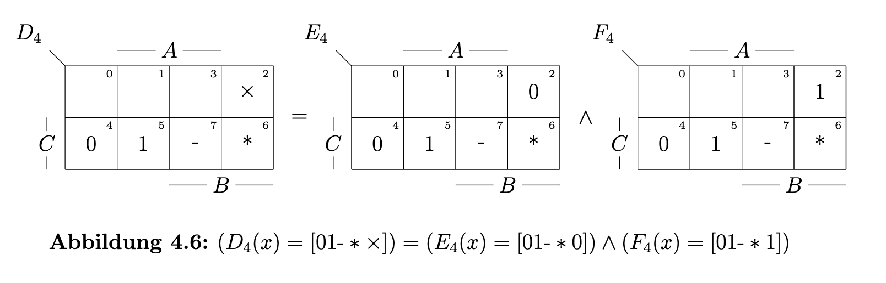
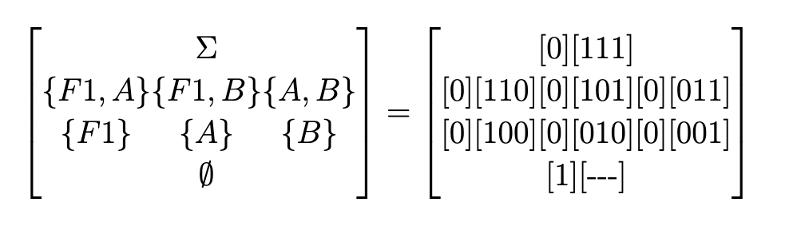

## Aufgabe 4.1:  Digitaler partieller Automat
### a. Was ist ein partieller Automat?
+ Normaler Automat: Für jede Kombination aus Zustand und Eingabe gibt es einen Folgezustand.
+ Partieller Automat: Es gibt Lücken, manche Eingaben sind nicht spezifiziert $\Longrightarrow$ markiert mit $*$.

### b. Ein Template für sicherheitskritische Systeme suchen
+ Falls ein $*$-Eingabe auftreten:
  + $\Longrightarrow$ aktuelle Zustand beibehalten.
  + $\Longrightarrow$ letzte gültige Eingabe gespeichert werden.

### c. Schaltung in typ-alt Realisierung für $A=(X,Y,Z,\delta,\lambda)$

+ $x:$ Eingabe
+ $z:$ spezifizierter Folgezustand 
+ $y:$ Ausgabe
+ $\delta:$ Zustandsübergangsfunktion
+ $\overline{h^*}:$ Verifikation, $*$-Eingaben erkennen
+ $\lambda:$ Ausgabefunktion
+ $a_x:$ alte, gespeicherte spezifizierte Eingabe $x$

#### Was passiert bei $*$-Eingabe?
+ $\overline{h^*}$ erkennt zunächst die nicht spezifizierte Eingabe. 
+ $\Longrightarrow$ $C_1 C_2 = 00$, $a_x$ bleibt gespeichert.
+ $\Longrightarrow$ kein Zustandwechsel, safe

### d. Typ-alt vs. Typ-neu
+ Typ-alt
  + $*$-Übergänge auf bereits **existierende Zustände** zurückgeführt werden, keine neuen Zustände eingeführt.
+ Typ-neu
  + $*$-Übergänge führen in diese **neu hinzugefügten Zustände**, etwas komplexer.

---
## Aufgabe 4.2: Hazards
### a. Was ist ein Hazard?
+ Ein unerwünschter, kurzzeitiger Signalimpuls (Glitch), der bei Schaltungsübergängen auftreten kann.
+ Obwohl der korrekte Endwert erreicht wird, kann es zwischenzeitlich zu falschen Werten kommen.

### b. Hazard-Funktion von 3.4
+ $\overline{h^*} = B \land (\overline{G} \lor \overline{E})$

| $B$ | $G$ | $E$ | $\overline{h^*}$ |  $h^* (\text{Warnung})$ | 
|-----|-----|----|----|---|
| 0 | 0 | 0 | 0 | 1 |
| 0 | 0 | 1 | 0 | 1 |
| 0 | 1 | 0 | 0 | 1 |
| 0 | 1 | 1 | 0 | 1 |
| 1 | 0 | 0 | 1 | 0 |
| 1 | 0 | 1 | 1 | 0 |
| 1 | 1 | 0 | 1 | 0 |
| 1 | 1 | 1 | 0 | 1 |
### c. Arten von Hazards
#### 1-Funktionshazards
+ Bei einer Transition die Funktion zwischenzeitlich einen falschen Wert annimmt.
+ Bei der Transition über [111] kann kurzzeitig ein falsches 1-Signal ($h^* = 1$) auftreten $\rightarrow$ Fehlalarm
  + [110] $\rightleftharpoons$ [111] $\rightleftharpoons$ [101] 
    + $h^*$: 0 $\rightleftharpoons$ 1 $\rightleftharpoons$ 0
  + Beide Richtungen möglich

#### 0-Funktionshazards
+ Bei der Transition über [110]/[101]/[100] kann kurzzeitig ein falsches 0-Signal ($h^* = 0$) auftreten $\rightarrow$ Sicherheitsschleuse (Security gate) öffnen.
  + [111] $\rightleftharpoons$ [101] $\rightleftharpoons$ [001]
    + $h^*$: 1 $\rightleftharpoons$ 0 $\rightleftharpoons$ 1
  + [111] $\rightleftharpoons$ [101] $\rightleftharpoons$ [100] $\rightleftharpoons$ [000]
    + $h^*$: 1 $\rightleftharpoons$ 0 $\rightleftharpoons$ 0 $\rightleftharpoons$ 1
  + [111] $\rightleftharpoons$ [110] $\rightleftharpoons$ [100] $\rightleftharpoons$ [000]
    + $h^*$: 1 $\rightleftharpoons$ 0 $\rightleftharpoons$ 0 $\rightleftharpoons$ 1
  + [010] $\rightleftharpoons$ [110] $\rightleftharpoons$ [111]
    + $h^*$: 1 $\rightleftharpoons$ 0 $\rightleftharpoons$ 1 

#### Dynamische Funktionshazards
+ Alle Gefahren von 0-Hazards und 1-Hazards gleichzeitig vereinen
  + [010] $\rightleftharpoons$ [110] $\rightleftharpoons$ [111] $\rightleftharpoons$ [101]
    + $h^*$: 1 $\rightleftharpoons$ 0 $\rightleftharpoons$ 1 $\rightleftharpoons$ 0
  + [001] $\rightleftharpoons$ [101] $\rightleftharpoons$ [111] $\rightleftharpoons$ [110]
    + $h^*$: 1 $\rightleftharpoons$ 0 $\rightleftharpoons$ 1 $\rightleftharpoons$ 0
+ Das Signal oszilliert zwischen 0 und 1, bevor es den Endwert erreicht.
  + maximale Gefahr für sicherheitskritische Systeme.

#### Erweiterung: Strukturhazards
+  Durch unterschiedliche Signallaufzeiten (Gatterverzögerungen) auf verschiedenen Pfaden, also durch die physikalische Struktur der Schaltung selbst entsteht.
+  Durch Schaltungsoptimierung behebbar, Funktionshazards sind nicht behebbar, nur vermeidbar.

---

## Aufgabe 4.3: Dekomposition von Multisets
### a. Was ist ein Multiset?
+ eine Menge, es gibt mehr als zwei Werte pro Zelle im KV-Diagramm als Darstellung.

### b. Bedeutung der Sonderzeichen im KV-Diagramm
+ $1:$ Spezifizierte 1
+ $0:$ Spezifizierte 0
+ $*:$ unspezifiziert
+ $-:$ Beliebig (0 oder 1)
+ $\times:$ Verboten / widersprüchlich

### c. Kompositionsregeln

**Verundungsregeln ($\land$) /QVL-Verknüpfungstabelle**

| $\land$ | 0 | 1 | $-$ | $\times$ | 
|-----|-----|----|----|----|
| 0 | 0 | $\times$ | 0 |$\times$|
| 1 | $\times$ | 1 | 1 |$\times$|
| $-$ | 0 | 1 | $-$ |$\times$|
| $\times$ | $\times$ | $\times$ | $\times$ |$\times$|

+ $* \land \times = *, \ * \land 1 = *$

**Veroderungsregeln ($\lor$) /QVL-Verknüpfungstabelle**

| $\lor$ | 0 | 1 | $-$ | $\times$ | 
|-----|-----|----|----|----|
| 0 | 0 | $-$ | $-$ |0|
| 1 | $-$ | 1 | $-$ |1|
| $-$ | $-$ | $-$ | $-$ |$-$|
| $\times$ | 0 | $1$ | $-$ |$\times$|

+ $* \lor 0 = 0$

### d. Dekomposition 

**Multiset $D_1$**

**Multiset $D_2$**

**Multiset $D_3$**

**Multiset $D_4$**

---
## Aufgabe 4.4: Codierung von Ereignissen bzw. Leitungen
### a. Grundbegriffe

+ Sei $\Sigma = \{S_{n-1}, S_{n-2}, \cdots, S_1, S_0\}$ die Menge aller Ereignisse (Leitungen). Eine nicht-leere Teilmenge $\sigma \in 2^{\Sigma} \setminus \{\emptyset\}$ soll in $\Sigma$ eingebettet werden.

+ $$\Sigma = \{S_0, S_1, S_2, \ldots, S_{n-1}\} \quad \leftarrow \text{Gesamtmenge aller Ereignisse}$$

$$\sigma \subseteq 2^{\Sigma}, \quad |\sigma| \geq 1 \quad \leftarrow \text{nicht-leere Teilmenge}$$

### b. Zwei Varianten der s-Codierung für Teilmengen

#### Variante 1 — Standardbinärcodierung

+ Jedes Ereignis $S_i \in \Sigma$ erhält eine eigene Stelle in $s$. Die leere Menge $\emptyset$ wird mit $[0 \cdots 0]$ codiert.

$$2^{\Sigma} = \left\{ \underbrace{[0,0,\cdots,0,0]}_{\emptyset},\ \underbrace{[0,0,\cdots,0,1]}_{\{S_0\}},\ \underbrace{[0,0,\cdots,1,0]}_{\{S_1\}},\ \cdots,\ \underbrace{[1,1,\cdots,1,1]}_{\Sigma} \right\}$$

$$= [s] = [s_{n-1},\ s_{n-2},\ \cdots,\ s_1,\ s_0]$$

#### Variante 2 — Erweiterte Codierung mit $s_\emptyset$-Stelle

+ Die leere Menge $\emptyset$ bekommt eine eigene zusätzliche Stelle $s_\emptyset$. Damit wird $[0\cdots0]$ zu einem undefinierten Punkt $*$.

$$2^{\Sigma} = \left\{ \underbrace{[1,-,\cdots,-,-]}_{\emptyset},\ \underbrace{[0,0,\cdots,0,1]}_{\{S_0\}},\ \underbrace{[0,0,\cdots,1,0]}_{\{S_1\}},\ \cdots,\ \underbrace{[0,1,\cdots,1,1]}_{\Sigma} \right\}$$

$$= [s]\setminus \{ [\emptyset] \} = [s_\emptyset,\ s_{n-1},\ s_{n-2},\ \cdots,\ s_1,\ s_0] \setminus \{ [\emptyset] \}$$

$$* = [0,0,\cdots,0,0] \quad \leftarrow \text{nicht definiert}$$

$$\emptyset = [1,-,-,\cdots,-,-] \quad \leftarrow \text{Nichts-Tun}$$

### c. Beispiel: $\Sigma = \{F1, A, B\}, s = (s_\emptyset, s_2, s_1, s_0)$

+ Mit $s = (s_\emptyset, s_2, s_1, s_0)$ werden alle Teilmengen von $2^\Sigma$ codiert.

$$s = (s_\emptyset,\ s_{F1},\ s_A,\ s_B)$$

**Codierungstabelle:**

| $\sigma$ | $[s_\emptyset, s_{F1}, s_A, s_B]$ |
|---|---|
| $\emptyset$ | $[1, -, -, -]$ |
| $\{B\}$ | $[0, 0, 0, 1]$ |
| $\{A\}$ | $[0, 0, 1, 0]$ |
| $\{F1\}$ | $[0, 1, 0, 0]$ |
| $\{A, B\}$ | $[0, 0, 1, 1]$ |
| $\{F1, B\}$ | $[0, 1, 0, 1]$ |
| $\{F1, A\}$ | $[0, 1, 1, 0]$ |
| $\{F1, A, B\} = \Sigma$ | $[0, 1, 1, 1]$ |
| $*$ | $[0, 0, 0, 0]$ |

**Mengeninklusionsdiagramm:**

### d. $*$-freier und hazardfreier Betrieb

+ Für hazardfreien Betrieb ist entscheidend: die axiomatische Fähigkeit des Einfrierens = Nichts-Tun.

$$\emptyset = [1][\underbrace{--\cdots-}_{n}] \quad \Rightarrow \quad \text{die Signale beliebige Werte angenommen, Garantie, Nichts-Tun, also hazardfrei}$$

+ z.B. Bei Funktionshazard

  + $$[0][101] \longrightarrow [0][010] \quad \leftarrow \text{Funktionshazard!}$$

  + $$[0][101] \circ \underbrace{[1][101]}_{\emptyset} \circ \underbrace{[1][010]}_{\emptyset} \circ [0][010]$$

### e. Offene und geschlossene Diamantstruktur

+ Siehe Musterlösung, Klausur irrelevant