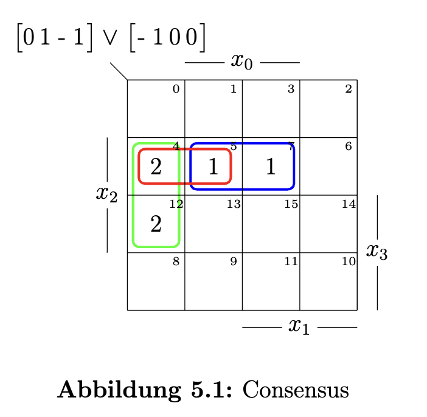
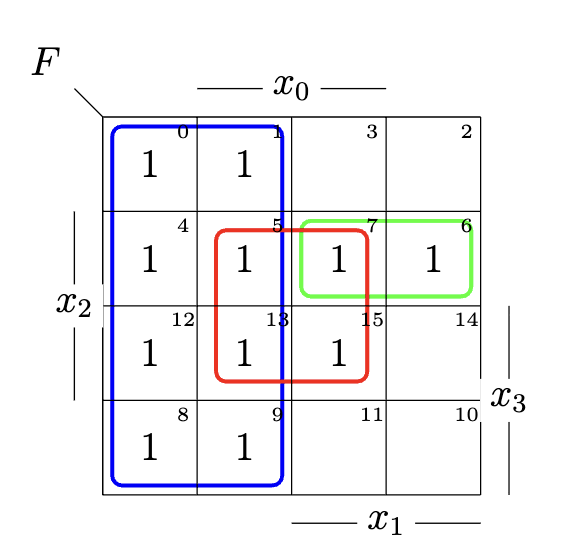
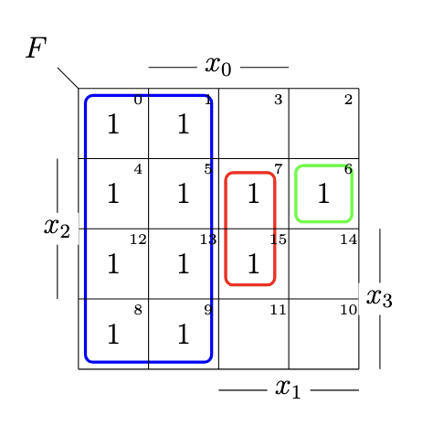
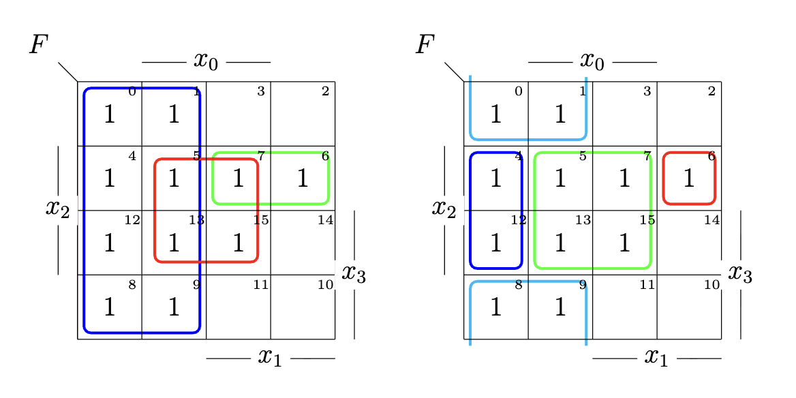

## Aufgabe 5.1:  Quaternäre Vektor-Logik (QVL)
### a. Neutrale Elemente

**QVL-Symbole**

| Symbol | Menge | Bedeutung |
|:------:|:-----:|-----------|
| `0` | {0} | nur Wert 0 |
| `1` | {1} | nur Wert 1 |
| `-` | {0,1} | Wert 0 oder 1 |
| `×` | {} | leere Menge |

**Das neutrale Element** einer Operation $\circ$ ist ein Element $e$, sodass gilt:

$$\forall a: \quad a \circ e = a$$

**Für die ∧-Operation:**

Das neutrale Element ist `-`, da `-` der Menge {0,1} entspricht und gilt:

$$- \wedge 0 \;=\; \{0, 1\} \cap \{0\} = \{0\} = 0$$
$$- \wedge 1 \;=\; \{0, 1\} \cap \{1\} = \{1\} = 1$$
$$- \wedge - \;=\; \{0, 1\} \cap \{0,1\} = \{0,1\} = -$$
$$- \wedge \times \;=\; \{0, 1\} \cap \{\} = \{\} = \times$$

**Für die ∨-Operation:**

Das neutrale Element ist `×`, da `×` der leeren Menge {} entspricht und gilt:

$$\times \vee 0 \;=\; \{\} \cup \{0\} = \{0\} = 0$$
$$\times \vee 1 \;=\; \{\} \cup \{1\} = \{1\} = 1$$
$$\times \vee - \;=\; \{\} \cup \{0, 1\} = \{0,1\} = -$$
$$\times \vee \times \;=\; \{\} \cup \{\} = \{\} = \times$$

---

### b. Rechnungen in QVL

**Gegeben sind folgende Vektoren:**

$$A = \begin{bmatrix} \times \\ 0 \\ 1 \\ - \\ 0 \\ 1 \\ \times \\ - \end{bmatrix}, \quad B = \begin{bmatrix} 1 \\ 1 \\ 0 \\ \times \\ 0 \\ - \\ 1 \end{bmatrix}$$

**Auffüllen mit neutralem Element**

Da Vektor $A$ acht Stellen und Vektor $B$ nur sieben Stellen hat, muss $B$ vor der Rechnung auf acht Stellen aufgefüllt werden.

Die Auffüllregel lautet:

- Bei **∧**: Auffüllen mit `-`
- Bei **∨**: Auffüllen mit `×`

Der Grund: Das neutrale Element verändert das Ergebnis an der aufgefüllten Stelle nicht.

#### b.1 $A \wedge B$

**Schritt 1: Auffüllen von B mit `-` an der höchsten Stelle**

$$B \;\longrightarrow\; B' = \begin{bmatrix} \mathbf{-} \\ 1 \\ 1 \\ 0 \\ \times \\ 0 \\ - \\ 1 \end{bmatrix}$$

**Schritt 2: Bitweise ∧-Operation durchführen**

$$\text{Stelle 7: } \times \wedge - \;=\; \{\} \cap \{0,1\} = \{\} = \times$$
$$\text{Stelle 6: } 0 \wedge 1 \;=\; \{0\} \cap \{1\} = \{\} = \times$$
$$\text{Stelle 5: } 1 \wedge 1 \;=\; \{1\} \cap \{1\} = \{1\} = 1$$
$$\text{Stelle 4: } - \wedge 0 \;=\; \{0,1\} \cap \{0\} = \{0\} = 0$$
$$\text{Stelle 3: } 0 \wedge \times \;=\; \{0\} \cap \{\} = \{\} = \times$$
$$\text{Stelle 2: } 1 \wedge 0 \;=\; \{1\} \cap \{0\} = \{\} = \times$$
$$\text{Stelle 1: } \times \wedge - \;=\; \{\} \cap \{0,1\} = \{\} = \times$$
$$\text{Stelle 0: } - \wedge 1 \;=\; \{0,1\} \cap \{1\} = \{1\} = 1$$

**Ergebnis:**

$$\boxed{A \wedge B = \begin{bmatrix} \times \\ \times \\ 1 \\ 0 \\ \times \\ \times \\ \times \\ 1 \end{bmatrix}}$$

#### b.2 $A \vee B$

**Schritt 1: Auffüllen von B mit `×` an der höchsten Stelle**

$$B \;\longrightarrow\; B'' = \begin{bmatrix} \mathbf{\times} \\ 1 \\ 1 \\ 0 \\ \times \\ 0 \\ - \\ 1 \end{bmatrix}$$

**Schritt 2: Bitweise ∨-Operation durchführen mit Veroderungsregeln ($\lor$)**

$$\text{Stelle 7: } \times \vee \times \;=\; \{\} \cup \{\} = \{\} = \times$$
$$\text{Stelle 6: } 0 \vee 1 \;=\; \{0\} \cup \{1\} = \{0,1\} = -$$
$$\text{Stelle 5: } 1 \vee 1 \;=\; \{1\} \cup \{1\} = \{1\} = 1$$
$$\text{Stelle 4: } - \vee 0 \;=\; \{0,1\} \cup \{0\} = \{0,1\} = -$$
$$\text{Stelle 3: } 0 \vee \times \;=\; \{0\} \cup \{\} = \{0\} = 0$$
$$\text{Stelle 2: } 1 \vee 0 \;=\; \{1\} \cup \{0\} = \{0,1\} = -$$
$$\text{Stelle 1: } \times \vee - \;=\; \{\} \cup \{0,1\} = \{0,1\} = -$$
$$\text{Stelle 0: } - \vee 1 \;=\; \{0,1\} \cup \{1\} = \{0,1\} = -$$

**Ergebnis:**

$$\boxed{A \vee B = \begin{bmatrix} \times \\ - \\ 1 \\ - \\ 0 \\ - \\ - \\ - \end{bmatrix}}$$

---

### c. Wertgleichheit zeigen

**Zu zeigen ist:**

$$\overline{A \wedge B} \;=\; \overline{A} \vee \overline{B}$$

**Was bedeutet Wertgleichheit?**

Zwei QVL-Ausdrücke sind wertgleich, wenn sie nach Umformungen dieselbe Menge repräsentieren.

**Komplementregeln in QVL:**

| Symbol | Komplement |
|:------:|:----------:|
| `0` | `1` |
| `1` | `0` |
| `-` | `×` |
| `×` | `-` |

**Links Seite**

$$A \wedge B = \begin{bmatrix} \times \\ \times \\ 1 \\ 0 \\ \times \\ \times \\ \times \\ 1 \end{bmatrix}, \quad \overline{A \wedge B} = \begin{bmatrix} - \\ - \\ 0 \\ 1 \\ - \\ - \\ - \\ 0 \end{bmatrix}$$

**Rechts Seite**

$$A = \begin{bmatrix} \times \\ 0 \\ 1 \\ - \\ 0 \\ 1 \\ \times \\ - \end{bmatrix}, \quad B = \begin{bmatrix} 1 \\ 1 \\ 0 \\ \times \\ 0 \\ - \\ 1 \end{bmatrix}$$

nach Komplement

$$\overline{A} = \begin{bmatrix} - \\ 1 \\ 0 \\ \times \\ 1 \\ 0 \\ - \\ \times \end{bmatrix}, \quad \overline{B} = \begin{bmatrix} 0 \\ 0 \\ 1 \\ - \\ 1 \\ \times \\ 0 \end{bmatrix}$$

Bei **$\lor$**: Auffüllen mit `×` für B

$$\overline{A} = \begin{bmatrix} - \\ 1 \\ 0 \\ \times \\ 1 \\ 0 \\ - \\ \times \end{bmatrix}, \quad \overline{B} = \begin{bmatrix} \times \\ 0 \\ 0 \\ 1 \\ - \\ 1 \\ \times \\ 0 \end{bmatrix}, \quad \overline{A} \lor \overline{B} = \begin{bmatrix} - \\ - \\ 0 \\ 1 \\ - \\ - \\ - \\ 0 \end{bmatrix}$$

$$\Rightarrow \quad \boxed{\overline{A \wedge B} \;=\; \overline{A} \vee \overline{B} ( \ \text{De Morgan's Laws})}$$

**Homework:** 
$$\overline{A \lor B} = \overline{A} \land \overline{B}$$

---
## Aufgabe 5.2: QVL = Mengendarstellung

### Vorwissen: Was ist Mengendarstellung?

**Kodierung：**

$$x = (x_7, x_6, x_5, x_4, x_3, x_2, x_1, x_0) \quad \text{mit} \quad x_i \in \{0, 1, -, \times\}$$

Jede Stelle $x_i$ wird als Teilmenge $X_i \subseteq [x]$ der Grundmenge dargestellt:

| QVL-Symbol $x_i$ | Mengendarstellung $X_i$ |
|:----------------:|:-----------------------:|
| `0` | $\{0\}$ — einelementige Menge|
| `1` | $\{1\}$ — einelementige Menge|
| `-` | $\{0,1\}$ — volle Teilmenge|
| `×` | $\{\}$ — leere Menge|

### a. Neutrale Elemente der Mengenoperationen

**Neutrales Element der $\cap$-Operation:**

Das neutrale Element der $\cap$-Operation ist die **gesamte Grundmenge $X$**.

**Beweis:**

Für jede beliebige Teilmenge $A \subseteq X$ gilt:

$$A \cap X = A$$

Das entspricht dem QVL-Symbol **`-`** = {0,1}, da {0,1} die gesamte Grundmenge ist.

$$\rightarrow \textbf{Neutrales Element der } \cap\textbf{-Operation: Grundmenge } X \;\widehat{=}\; [-]$$

### Neutrales Element der $\cup$-Operation:

Das neutrale Element der $\cap$-Operation ist die **leere Menge $\emptyset$**.

**Beweis:**

Für jede beliebige Teilmenge $A \subseteq X$ gilt:

$$A \cup \emptyset = A$$

Das entspricht dem QVL-Symbol **`×`** = {}, da {} die leere Menge ist.

$$\rightarrow \textbf{Neutrales Element der } \cup\textbf{-Operation: leere Menge } \emptyset \;\widehat{=}\; [\times]$$

---

### b. Rechnungen in Mengendarstellung

**Gegebene Belegungen:**

Aus Aufgabe 5.1 übernehmen wir die Vektoren $A$ und $B$ und übersetzen sie in Mengen:

$$A = \begin{bmatrix} \times \\ 0 \\ 1 \\ - \\ 0 \\ 1 \\ \times \\ - \end{bmatrix} \;\longrightarrow\; \{\overline{X_6}, X_5, X_4, \overline{X_4}, \overline{X_3}, X_2, X_0, \overline{X_0}\}$$

$$B = \begin{bmatrix} 1 \\ 1 \\ 0 \\ \times \\ 0 \\ - \\ 1 \end{bmatrix} \;\longrightarrow\; \{X_6, X_5, \overline{X_4}, \overline{X_2}, X_1, \overline{X_1}, X_0\}$$

#### b.1: $A \cap B$

**Dies entspricht der ∧-Operation aus Aufgabe 5.1a.**

$$\boxed{A \wedge B = \begin{bmatrix} \times \\ \times \\ 1 \\ 0 \\ \times \\ \times \\ \times \\ 1 \end{bmatrix}}$$

$$\boxed{
\begin{aligned}
A \cap B = \{\overline{X_6}, X_5, X_4, \overline{X_4}, \overline{X_3}, X_2, X_0, \overline{X_0}\} \cap \{X_6, X_5, \overline{X_4}, \overline{X_2}, X_1, \overline{X_1}, X_0\} = \{ X_5, \overline{X_4}, X_0\}
\end{aligned}
}$$

#### b.2: $A \cup B$

**Dies entspricht der ∨-Operation aus Aufgabe 5.1b.**

$$\boxed{A \vee B = \begin{bmatrix} \times \\ - \\ 1 \\ - \\ 0 \\ - \\ - \\ - \end{bmatrix}}$$

$$\boxed{
\begin{aligned}
A \cup B &= \{\overline{X_6}, X_5, X_4, \overline{X_4}, \overline{X_3}, X_2, X_0, \overline{X_0}\} \\
&\quad \cup \{X_6, X_5, \overline{X_4}, \overline{X_2}, X_1, \overline{X_1}, X_0\} \\
&= \{X_6, \overline{X_6}, X_5, X_4, \overline{X_4}, \overline{X_3}, X_2, \overline{X_2}, X_1, \overline{X_1}, X_0, \overline{X_0}\}
\end{aligned}
}$$

---

### c.: Wertgleichheit beweisen

**Zu zeigen ist:**
$$\overline{A \cap B} = \overline{A} \cup \overline{B}$$

**Schritt 1: Komplement der Mengen bilden**

**Links Seite**

$$\boxed{\overline{A \cap B} = \{X_7, \overline{X_7}, X_6, \overline{X_6}, \overline{X_5}, X_4, X_3, \overline{X_3}, X_2, \overline{X_2}, X_1, \overline{X_1}, \overline{X_0}\}}$$

**Rechts Seite**

$$\overline{A} = \{X_7, \overline{X_7}, X_6, \overline{X_5}, X_3, \overline{X_2}, X_1, \overline{X_1}\}$$

$$\overline{B} = \{X_7, \overline{X_7}, \overline{X_6}, \overline{X_5}, X_4,  X_3, \overline{X_3}, X_2, \overline{X_0}\}$$

$$\boxed{\overline{A} \cup \overline{B} =  \{X_7, \overline{X_7}, X_6, \overline{X_6}, \overline{X_5}, X_4, X_3, \overline{X_3}, X_2, \overline{X_2}, X_1, \overline{X_1}, \overline{X_0}\}}$$

$$\Rightarrow \quad \boxed{\overline{A \cap B} \;=\; \overline{A} \cup \overline{B} ( \ \text{De Morgan's Laws})}$$

---

## Aufgabe 5.3: TVL 

**TVL = Ternäre Vektor-Logik**

> „Ternär" bedeutet „dreiwertig", im Unterschied zu QVL gibt es kein `×`-Symbol mehr.

**TVL-Symbole**

| Symbol | Menge | Bedeutung |
|:------:|:-----:|-----------|
| `0` | {0} | nur Wert 0|
| `1` | {1} | nur Wert 1|
| `-` | {0,1} | Wert 0 oder 1|

**Neutrale Elemente in TVL**

| Operation | Neutrales Element | 
|:---------:|:-----------------:|
| $\wedge$ | `[-]` = {0,1} | 
| $\vee$ | `[×]` = {} |

**Hinweis:**
> Das neutrale Element der $\vee$-Operation wäre theoretisch `×` = {},
> aber da `×` in TVL nicht existiert, ist $\wedge$ das primäre Werkzeug.

**Gegebenen Vektoren definieren**

$$A = \begin{bmatrix} 0 \\ 1 \\ - \\ 1 \end{bmatrix}, \quad B_1 = \begin{bmatrix} 1 \\ 0 \\ 1 \end{bmatrix}, \quad B_2 = \begin{bmatrix} 1 \\ 0 \\ 0 \end{bmatrix}$$

Mit der Kodierung $x = (x_3, x_2, x_1, x_0)$.

---

### a. $A \wedge B_1$

**Auffüllen von $B_1$ mit [-]:**

$$B_1 \;\longrightarrow\; B_1' = \begin{bmatrix} \mathbf{-} \\ 1 \\ 0 \\ 1 \end{bmatrix}$$

**Bitweise $\wedge$-Operation**

$$\text{Stelle 3: } 0 \wedge - \;=\; \{0\} \cap \{0,1\} = \{0\} = 0$$
$$\text{Stelle 2: } 1 \wedge 1 \;=\; \{1\} \cap \{1\} = \{1\} = 1$$
$$\text{Stelle 1: } - \wedge 0 \;=\; \{0,1\} \cap \{0\} = \{0\} = 0$$
$$\text{Stelle 0: } 1 \wedge 1 \;=\; \{1\} \cap \{1\} = \{1\} = 1$$

**Ergebnis:**

$$\boxed{A \wedge B_1 = \begin{bmatrix} 0 \\ 1 \\ 0 \\ 1 \end{bmatrix}}$$

---

### b. $A \wedge B_2$

**Auffüllen von $B_2$ mit [-]**

$$B_2 \;\longrightarrow\; B_2' = \begin{bmatrix} \mathbf{-} \\ 1 \\ 0 \\ 0 \end{bmatrix}$$

**Bitweise $\wedge$-Operation**

$$\text{Stelle 3: } 0 \wedge - \;=\; \{0\} \cap \{0,1\} = \{0\} = 0$$
$$\text{Stelle 2: } 1 \wedge 1 \;=\; \{1\} \cap \{1\} = \{1\} = 1$$
$$\text{Stelle 1: } - \wedge 0 \;=\; \{0,1\} \cap \{0\} = \{0\} = 0$$
$$\text{Stelle 0: } 1 \wedge 0 \;=\; \{1\} \cap \{0\} = \{\} = \mathbf{\times}$$

> **Problem: An Stelle 0 entsteht `×`!**

> Da das Ergebnis `×` enthält, was in TVL nicht erlaubt ist, ist die Operation
$A \wedge B_2$ in TVL nicht definiert.

$$\boxed{A \wedge B_2 \;\text{ ist in TVL nicht definiert!}}$$

---

### c. $A \vee B_2$

**Nachbarschaftsbeziehung prüfen**

> Zwei TVL-Vektoren $X_i$ und $X_j$ stehen in einer Nachbarschaftsbeziehung,
> wenn es **genau eine** Stelle $r$ gibt, an der sie Werte komplementär sind:

$$\exists! \, x_r : \quad X^i(x_r) = \overline{ X^j(x_r)}$$

**Prüfung für $A = [01{-}1]$ und $B_2' = [{-}100]$:**

$$B_2 \;\longrightarrow\; B_2' = \begin{bmatrix} \mathbf{-} \\ 1 \\ 0 \\ 0 \end{bmatrix}$$

| Stelle | $A$ | $B_2'$ | komplementär ? |
|:------:|:---:|:-------:|:------------:|
| 3 | `0` | `-` | nein|
| 2 | `1` | `1` | nein|
| 1 | `-` | `0` | nein|
| 0 | `1` | `0` | ja |

> Es gibt **genau eine** Stelle (Stelle 0), an der Werte komplementär sind.

> Nachbarschaftsbeziehung liegt vor!
> Die Resolvierung durchgeführt werden.

**Resolvente-Regeln ($\lor$)**

| $\lor$ | 0 | 1 | $-$ | 
|-----|-----|----|----|
| 0 | 0 | $-$ | 0 | 
| 1 | $-$ | 1 | 1 | 
| $-$ | 0 | 1 | $-$ | 

$$\text{Stelle 3: } 0 \vee - \;=\;  0$$
$$\text{Stelle 2: } 1 \vee 1 \;=\;  1$$
$$\text{Stelle 1: } - \vee 0 \;=\;  0$$
$$\text{Stelle 0: } 1 \vee 0 \;=\;  -$$

**Ergebnis**

$$A \vee B_2 = \begin{bmatrix} 0 \\ 1 \\ 0 \\ - \end{bmatrix}$$

**Consensus im KV-Diagramm prüfen**

> Ein überdeckender Block (Consensus) entsteht, wenn das $\lor$-Ergebnis einen Block liefert,
> der bereits vollständig überdeckt wird.
> In diesem Fall kann das Ergebnis verworfen werden (Optimierung).

---

## Aufgabe 5.4: TVL-Orthogonalisierung

**Was ist Orthogonalisierung?**

>Orthogonalisierung bedeutet: Eine TVL-Formel so umschreiben, dass sich alle Blöcke nicht überlappen.

>Zwei TVL-Vektoren $X_i$ und $X_j$ sind orthogonal (disjunkt), wenn gilt:
$$X_i \wedge X_j = \times \quad \text{(leere Menge)}$$

**Orthogonalisierungsregel**

Gegeben zwei TVL-Vektoren $X_i$ und $X_j$ mit Überlappung.

Man ersetzt $X_j$ durch $X_j \setminus X_i$:

$$X_j^{\text{n}} = X_j \setminus X_i = X_j \wedge \overline{X_i}$$

Das heißt: Aus $X_j$ wird der Teil entfernt, der bereits in $X_i$ liegt.

**Gegebene Formel definieren**

$$F = \underbrace{[--0-]}_{F_1} \vee \underbrace{[-1-1]}_{F_2} \vee \underbrace{[011-]}_{F_3}$$

Mit der Kodierung $x = (x_3, x_2, x_1, x_0)$.

**Zunächst: Überlappungen identifizieren**

>**Überlappung zwischen $F_1 = [--0-]$ und $F_2 = [-1-1]$**

$$F_1 \wedge F_2:$$
$$\text{Stelle 3: } - \wedge - = -$$
$$\text{Stelle 2: } - \wedge 1 = 1$$
$$\text{Stelle 1: } 0 \wedge - = 0$$
$$\text{Stelle 0: } - \wedge 1 = 1$$

$$F_1 \wedge F_2 = [-101] \neq \times \quad \Rightarrow \text{ Überlappung vorhanden!}$$

>**Überlappung zwischen $F_1 = [--0-]$ und $F_3 = [011-]$:**

$$F_1 \wedge F_3:$$
$$\text{Stelle 3: } - \wedge 0 = 0$$
$$\text{Stelle 2: } - \wedge 1 = 1$$
$$\text{Stelle 1: } 0 \wedge 1 = \times$$
$$\Rightarrow F_1 \wedge F_3 = \times \quad \Rightarrow \text{ keine Überlappung!}$$

>**Überlappung zwischen $F_2 = [-1-1]$ und $F_3 = [011-]$:**

$$F_2 \wedge F_3:$$
$$\text{Stelle 3: } - \wedge 0 = 0$$
$$\text{Stelle 2: } 1 \wedge 1 = 1$$
$$\text{Stelle 1: } - \wedge 1 = 1$$
$$\text{Stelle 0: } 1 \wedge - = 1$$

$$F_2 \wedge F_3 = [0111] \neq \times \quad \Rightarrow \text{ Überlappung vorhanden!}$$

---

### a. Zwei alternative Orthogonalisierungen

#### Orthogonalisierung 1: $F_2$ und $F_3$ bezüglich $F_1$ orthogonalisieren

**Schritt 1: Komplement von $F_1 = [--0-]$ berechnen**

$$\overline{F_1} = [--1-]$$

**Schritt 2: $F_2$ orthogonalisieren**

$$F_2^{\text{n}} = F_2 \wedge \overline{F_1} = [-1-1] \wedge [--1-]$$

$$\text{Stelle 3: } - \wedge - = -$$
$$\text{Stelle 2: } 1 \wedge - = 1$$
$$\text{Stelle 1: } - \wedge 1 = 1$$
$$\text{Stelle 0: } 1 \wedge - = 1$$

$$\boxed{F_2^{\text{n}} = [-111]}$$

**Schritt 3: $F_3$ prüfen**

$F_3 \wedge F_1 = \times$ $\rightarrow$ $F_3$ überlappt nicht mit $F_1$ $\rightarrow$ keine Änderung nötig!

Aber: $F_3$ und $F_2^{\text{n}}$ überlappen noch?

$$F_2^{\text{n}} \wedge F_3 = [-111] \wedge [011-]:$$
$$\text{Stelle 3: } - \wedge 0 = 0$$
$$\text{Stelle 2: } 1 \wedge 1 = 1$$
$$\text{Stelle 1: } 1 \wedge 1 = 1$$
$$\text{Stelle 0: } 1 \wedge - = 1$$

$$F_2^{\text{n}} \wedge F_3 = [0111] \neq \times \quad \Rightarrow \text{ noch Überlappung!}$$

**Schritt 4: $F_3$ bezüglich $F_2^{\text{n}}$ orthogonalisieren**

$$\overline{F_2^{\text{n}}} = \overline{[-111]} = [-0--] \vee [--0-] \vee [---0]$$

$$F_3^{\text{n}} = F_3 \wedge \overline{F_2^{\text{n}}} = [011-] \wedge ([-0--] \vee [--0-] \vee [---0]) = [0110]$$

**Ergebnis Orthogonalisierung 1:**

$$\boxed{F = \underbrace{[--0-]}_{F_1} \vee \underbrace{[-111]}_{F_2^n} \vee \underbrace{[0110]}_{F_3^n}}$$

---

### Orthogonalisierung 2: $F_1$ und $F_3$ bezüglich $F_2$ orthogonalisieren

>...
>Schritte überspringen, Studenten selbst üben sollen
>...

**Ergebnis Orthogonalisierung 2:**

---

### Orthogonalisierung mit Blocktausch

> Klausur irrelevant

---

### Orthogonalisierung der 8×6-Matrix G

> Mach es für Spaß, nicht so komplexer in Klausur.

---