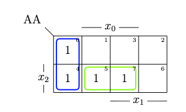
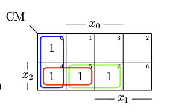

## Vorbemerkung: Die sechts Darstellungen

Dieselbe Boolesche Funktion hat sechs verschiedenen Darstellungen:

```
Boolesche Funktion f
    ├── AA  — Aussagenlogischer Ausdruck
    ├── CM  — Cantorsche Menge
    ├── CA  — Cantorscher Ausdruck
    ├── TVL — Ternärvektorliste
    ├── QVL — Quaternärvektorliste
    └── ME — Menge
```
---

### 1. AA — Aussagenlogischer Ausdruck

Die bekannte Schreibweise:

$$x_2 \bar{x}_1 \vee x_2 x_1 x_0 \vee \bar{x}_1 \bar{x}_0$$

- $\wedge$ (Produkt) = AND, $\vee$ (Summe) = OR, $\bar{x}$ = NOT
- Jeder Term ist Produktterm ($\wedge$ vernachlässigbar)

---

### 2. CM — Cantorsche Menge

**Grundidee:** 
- Jeder Produktterm wird als Menge (Operand) von Literalen dargestellt. 

| Produktterm | CM-Darstellung |
|-------------|----------------|
| $x_2 \bar{x}_1 $ | $\{x_2, \bar{x}_1 \}$ |
| $x_2 x_1 x_0$ | $\{x_2, x_1, x_0\}$ |


- Wichtige Operatoren:

| Operator | Symbol | Mengenoperation | 
|----------|--------|-----------------|
| Join (Vereinigung) | $\sqcup$ | Vereinigungsmenge | 
| Meet (Durchschnitt) | $\sqcap$ | Schnittmenge |

<!--
+ Beispiele:

$$\{x_2, x_0\} \sqcap \{\bar{x}_2, x_1, x_0\} = \{x_0\} $$

$$\{x_2, x_0\} \sqcup \{\bar{x}_2, x_1, x_0\} = \{x_1, x_0\}$$

> Je **kleiner** die Menge, desto **größer** die Überdeckung.
> Die leere Menge $\{\}$ = id = tautologisches Element (alles abdecken).


-->

**Transformation (Operation)**:

$$
\underbrace{A \sqcup B}_{CM} \; \longleftrightarrow \underbrace{A \lor B}_{AA}
$$

$$
\underbrace{A \sqcap B}_{CM} \; \longleftrightarrow \underbrace{A \land B}_{AA}
$$


---

### 3. CA — Cantorscher Ausdruck

**Grundidee:** 
+ Jeder Produktterm wird als Vektor geschrieben (Einträge: $0$, $1$, $-$) 

| Produktterm | CA-Darstellung |
|-------------|----------------|
| $x_2 \bar{x}_1 $ | $[1 \ 0 \ - ]$ |
| $x_2 x_1 x_0$ | $[1 \ 1 \ 1 ]$ |

**Transformation (Operation)**:

$$
\underbrace{A \lor B}_{CA} \; \longleftrightarrow \underbrace{A \sqcap B}_{CM}
$$

$$
\underbrace{A \land B}_{CA} \; \longleftrightarrow \underbrace{A \sqcup B}_{CM}
$$ 


---

### 4. TVL — Ternärvektorliste

**Grundidee:** 
+ Jeder Produktterm wird als Vektor geschrieben (Einträge: $0$, $1$, $-$) 

| Produktterm | TVL-Darstellung |
|-------------|----------------|
| $x_2 \bar{x}_1 $ | $[1 \ 0 \ - ]$ |
| $x_2 x_1 x_0$ | $[1 \ 1 \ 1 ]$ |

**Transformation (Operation)**:

$$
\underbrace{A \lor B}_{TVL} \; \longleftrightarrow \underbrace{A \land B}_{CA}
$$

$$
\underbrace{A \land B}_{TVL} \; \longleftrightarrow \underbrace{A \lor B}_{CA}
$$

---

### 5. QVL — Quaternärvektorliste

**Grundidee:** 
+ Erweiterung der TVL um den vierten Wert $\times$ (ungültig/nicht beteiligt).

**Kodierung TVL nach QVL:**
+ Belegungen in TVL bestimmen
+ Alle möglichen Kombi. in TVL auflisten
+ Jede Symbol in QVL kodiert zwei Kombi von LSB nach MSB.
  + rechts Kombi. treffen $\rightarrow$ Symbol `0`
  + links Kombi. treffen $\rightarrow$ Symbol `1`
  + beide Kombi. treffen $\rightarrow$ Symbol `-`
  + nichts treffen $\rightarrow$ Symbol $\times$

**Beispiel:**

$$
\underbrace{[1 \ 0 \ -]}_{TVL} \; \longleftrightarrow \underbrace{[\times \ - \ \times \ \times]}_{QVL}
$$

### 6. ME-Darstellung 

+ Alle möglichen Komb.. in Produktterm von TVL auflisten

+ Alle zugehörige Minterm in ME auflisten

**Beispiel:**

| Minterm | $[1 \ 0 \ -]$ | Dezimal |
|---------|--------------|---------|
| $X_4$ | 100 | 4 |
| $X_5$ | 101 | 5 |

+ $\Rightarrow \{ X_4, X_5\}$

---
## Aufgabe 6.1: Formatierung von Aussagenlogischen Ausdrücken


### Gegebener Ausdruck

$$f = x_2 x_1 \vee x_2 x_1 x_0 \vee \bar{x}_1 x_0 \tag{6.1}$$


**CM**

$$\text{CM} = \{x_2, \bar{x}_1\} \sqcup \{x_2, x_1, x_0\} \sqcup \{\bar{x}_1, \bar{x}_0\}$$


**CA**

$$\text{CA} = [1 \ 0 \ -] \ \land \ [1 \ 1 \ 1] \ \land \ [- \ 0 \ 0]$$


**TVL**

$$
\text{TVL} = [1 \ 0 \ -] \ \lor \ [1 \ 1 \ 1] \ \lor \ [- \ 0 \ 0] 
$$
$$
= 
\begin{bmatrix}
1 & 0 & - \\
1 & 1 & 1 \\
- & 0 & 0
\end{bmatrix}

$$


**QVL**

$$
\text{QVL} =
\begin{bmatrix}
\times & - & \times & \times
\end{bmatrix}
\vee
\begin{bmatrix}
1 & \times & \times & \times
\end{bmatrix}
\vee
\begin{bmatrix}
\times & 0 & \times & 0
\end{bmatrix}
$$


**ME**

$$\text{ME} = \{X_4, X_5\} \cup \{X_7\} \cup \{X_4, X_0\}$$

---

## Aufgabe 6.2: Symbolisches Rechnen

**Konsensustheorem**

$$ab \vee \bar{a}c \vee bc = ab \vee \bar{a}c$$

d.h.: Wenn $ab$ und $\bar{a}c$ beide vorhanden sind, ist $bc$ redundant und kann weggelassen werden.

**Distributive Laws**

$$a \lor (b \land c) = (a \lor b) \land (a \lor c)$$
$$a \land (b \lor c) = (a \land b) \lor (a \land c)$$

---

**Rechnen in AA**

$$f = x_2 \bar{x}_1 \vee x_2 x_1 x_0 \vee \bar{x}_1 \bar{x}_0$$

**Schritt 1: Distributive Laws**

$$= x_2 (\bar{x}_1 \vee x_1 x_0) \vee \bar{x}_1 \bar{x}_0 \\ = x_2 ((\bar{x}_1 \lor x_1) \land (\bar{x}_1 \lor x_0)) \vee \bar{x}_1 \bar{x}_0 \\ = x_2(\bar{x}_1 \lor x_0) \vee \bar{x}_1 \bar{x}_0 \\ = x_2\bar{x}_1 \lor x_2x_0 \vee \bar{x}_1 \bar{x}_0$$


**Schritt 2: Konsensustheorem** 
$$a = x_0, b = \bar{x}_1, c = x_2$$

**Ergebnis:**

$$\boxed{f_{\text{AA}} = x_2 x_0 \vee \bar{x}_1 \bar{x}_0}$$

**Überprüfung mit KV-Diagramm**


---

**Rechnen in CM**


$$\text{CM} = \{x_2, \bar{x}_1\} \sqcup \{x_2, x_1, x_0\} \sqcup \{\bar{x}_1, \bar{x}_0\}$$

$$ = \{x_2, x_1, \bar{x}_1, x_0\} \sqcup \{\bar{x}_1, \bar{x}_0\} \\ = \{x_2, (-), x_0\} \sqcup \{\bar{x}_1, \bar{x}_0\} $$

$$ = \{x_2, x_0\} \sqcup \{\bar{x}_1, \bar{x}_0\} 
\\ = \{x_2, \bar{x}_1, x_0, \bar{x}_0\} \\ = 
\{x_2, \bar{x}_1\}$$


**Ergebnis ist Consensus in KV-Diagramm**



---

**Rechnen in CA**

$$\text{CA} = [1 \ 0 \ -] \ \land \ [1 \ 1 \ 1] \ \land \ [- \ 0 \ 0] \\ = [1 \ \times \ 1] \ \land \ [- \ 0 \ 0] \\ = [1 \ - \ 1] \ \land \ [- \ 0 \ 0] \\ =  [1 \ 0 \ \times] = [1 \ 0 \ -]$$

**Ergebnis ist Consensus in KV-Diagramm**

---


**Rechnen in TVL**

$$
\text{TVL} = [1 \ 0 \ -] \ \lor \ [1 \ 1 \ 1] \ \lor \ [- \ 0 \ 0] 
$$
$$
= 
\begin{bmatrix}
1 & 0 & - \\
1 & 1 & 1 \\
- & 0 & 0
\end{bmatrix}

$$

**Schritt 1 — Consensus aus Zeile 1 und Zeile 2:**

Zeile 1 $[1\ 0\ -]$ und Zeile 2 $[1\ 1\ 1]$ unterscheiden sich in $x_1$ (Werte 0 und 1 → komplementär).

Consensuszeile: komplementäre Stelle entfernen, übrige Stellen zusammenführen:

$$\rightarrow [1\ -\ 1]$$

TVL wird zu:

$$\begin{bmatrix}1&0&-\\1&1&1\\-&0&0\\1&-&1\end{bmatrix}$$

**Schritt 2 — Absorption:** Zeile 2 $[1\ 1\ 1]$ wird von der neuen Zeile $[1\ -\ 1]$ überdeckt $\rightarrow$ Zeile 2 entfernen:

$$\begin{bmatrix}1&0&-\\-&0&0\\1&-&1\end{bmatrix}$$

**Schritt 3 — Consensus aus Zeile 2 und Zeile 3:**

TVL wird zu:

$$\begin{bmatrix}1&0&-\\-&0&0\\1&-&1\\1&0&-\end{bmatrix}$$ 

**Schritt 4 - Absorption Consensus**
$$\boxed{\text{TVL} = \begin{bmatrix}1&-&1\\-&0&0\end{bmatrix}}$$


---
**Rechnen in QVL**
$$
\text{QVL} =
\begin{bmatrix}
\times & - & \times & \times
\end{bmatrix}
\vee
\begin{bmatrix}
1 & \times & \times & \times
\end{bmatrix}
\vee
\begin{bmatrix}
\times & 0 & \times & 0
\end{bmatrix}
$$

$$
=
\begin{bmatrix}
1 & - & \times & \times
\end{bmatrix}
\vee
\begin{bmatrix}
\times & 0 & \times & 0
\end{bmatrix}
$$

$$
=
\begin{bmatrix}
1 & - & \times & 0
\end{bmatrix}
$$

---

**Rechnen in ME**

$$\text{ME} = \{X_4, X_5\} \cup \{X_7\} \cup \{X_4, X_0\}$$

$$ = \{X_0, X_4, X_5, X_7\}$$
---
