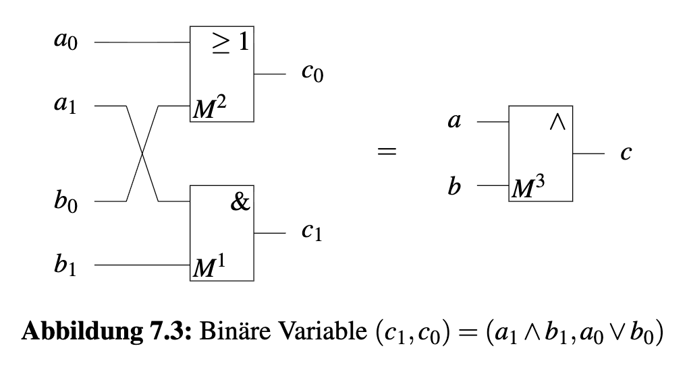
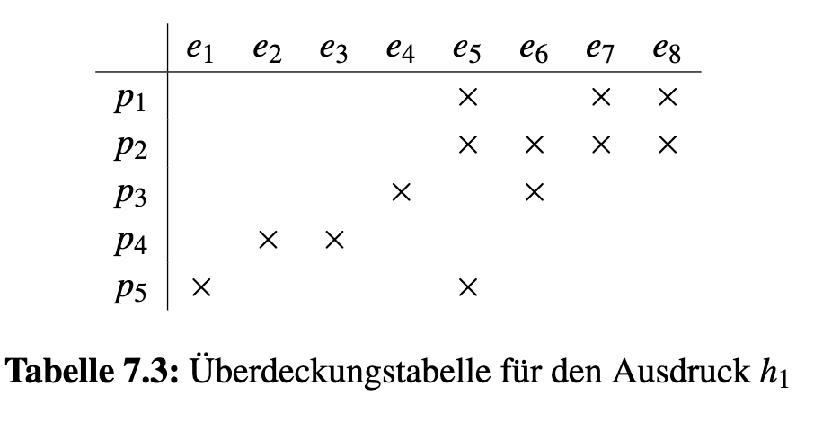
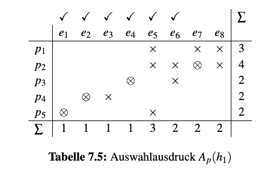
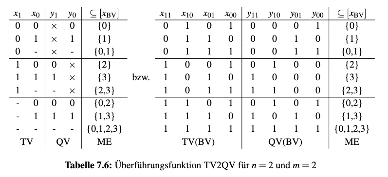
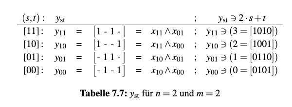
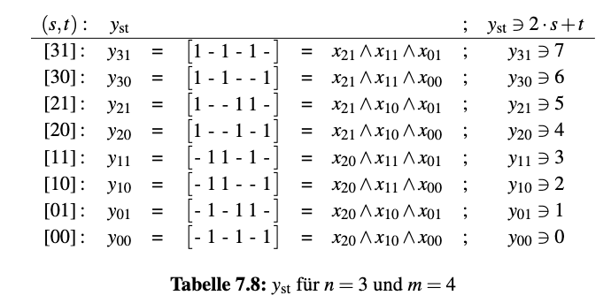
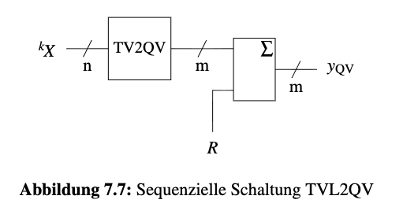
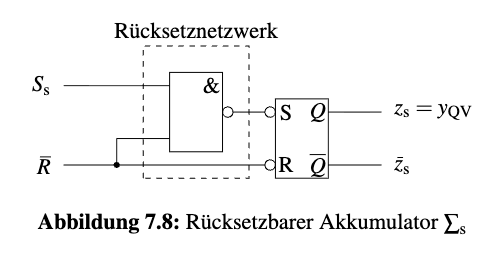
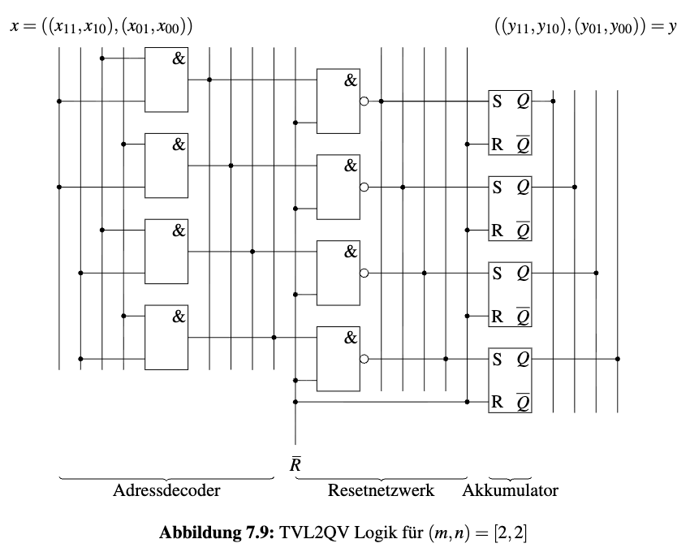
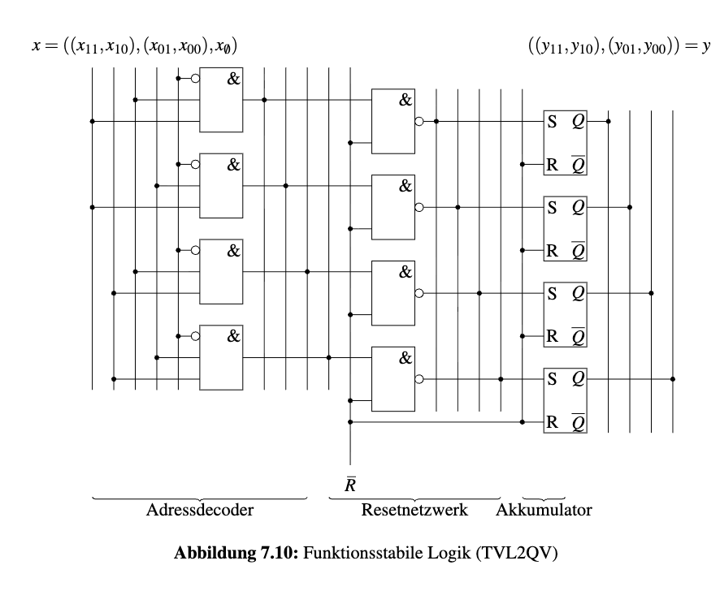

## Aufgabe 7.1: Parallele Komposition von Automaten

---

### Vorbemerkung: Formeln für Dekomposition und Komposition
* **Encoder $\rho$ (Dekomposition):** $$\rho: \sigma \mapsto (\sigma_1, \sigma_2) \quad \text{mit} \quad \sigma = \sigma_1 \cup \sigma_2$$
* **Decoder $\rho^{-1}$ (Komposition):** $$\rho^{-1}: (\sigma_1, \sigma_2) \mapsto \sigma$$

### Bedingung der Komposition
Der Decoder $\sigma_1 \sqcup \sigma_2$ ist nur dann definiert, wenn folgende Bedingung erfüllt ist:
$$\sigma_1 \cap \Sigma_2 \cup \sigma_2 \cap \Sigma_1 = \sigma_1 \cap \sigma_2$$

$\cap$ vernachlässigen:

$$\sigma_1 \Sigma_2 \cup \sigma_2 \Sigma_1 = \sigma_1 \sigma_2$$

Wenn die Bedingung erfüllt ist, gilt für das Resultat:
$$\sigma = \sigma_1 \sqcup \sigma_2 = (\sigma_1 \setminus \Sigma_2) \cup (\sigma_2 \setminus \Sigma_1) \cup (\sigma_1 \sigma_2) \tag{7.1}$$

---

### a. Gegeben Automaten mit den Ereignismengen:

* $\Sigma_1 = \{A, \overline{A}, C, \overline{C}\}$
* $\Sigma_2 = \{A, \overline{A}, E, \overline{E}\}$

Mit der Codierung $t = (E, C, A)$ ergibt sich $\Sigma_1$ und $\Sigma_2$ in QVL:

* $\Sigma_1 = [\times \ - \ -]_{QVL}$
* $\Sigma_2 = [- \ \times \ -]_{QVL}$

---
### b. Diskutieren, ob die Komposition difiniert wird

#### Fall 1: Komposition von $(\sigma_1, \sigma_2) = (\{A, C\}, \{A, \overline{E}\})$

**Mit der Codierung $t = (E, C, A)$ ergibt sich $\sigma_1$ und $\sigma_2$ in QVL:**

* $\sigma_1 = [\ \times \ 1 \ 1]_{QVL}$
* $\sigma_2 = [0 \ \times\ 1]_{QVL}$

**Überprüfung der Bedingung**

* Linke Seite (LS):
  $$\sigma_1 \cap \Sigma_2 = [\times \ 1  \ 1] \cap [- \ \times \ -] = [\times \ \times \ 1]$$
  $$\sigma_2 \cap \Sigma_1 = [0 \ \times \ 1] \cap [\times \ -  \ -] = [\times \ \times \ 1]$$
  $$LS = (\sigma_1 \cap \Sigma_2) \cup (\sigma_2 \cap \Sigma_1) = [\times \ \times \ 1] \cup [\times \ \times \ 1] = [\times \ \times \ 1]$$

* Rechte Seite (RS):
  $$RS = \sigma_1 \cap \sigma_2 = [\times \ 1 \ 1] \cap [0 \ \times \ 1] = [\times \ \times \ 1]$$

Da $LS = RS = [\times, \times, 1]$ (wertgleich), ist die Komposition definiert.

**Berechnung des zusammengesetzten Automaten $\sigma$ mit Formel 7.1**

$$\sigma = (\sigma_1 \setminus \Sigma_2) \cup (\sigma_2 \setminus \Sigma_1) \cup (\sigma_1 \cap \sigma_2)$$

* $\sigma_1 \setminus \Sigma_2  = \sigma_1 \land \overline{\Sigma}_2 = [\ \times \ 1 \ 1] \land [\times \ - \ \times] = [ \times \ 1 \ \times]$
* $\sigma_2 \setminus \Sigma_1  = \sigma_2 \land \overline{\Sigma}_1 = [0 \ \times \ 1] \land [- \ \times \ \times] = [ 0 \ \times \ 1]$
* $\sigma_1 \cap \sigma_2 = [\times \ \times \ 1]$

**Vereinigung:**
$$\sigma = [\times \ 1 \ \times] \cup [ 0 \ \times \ 1] \cup [\times \ \times \ 1] = [0 \ 1 \ 1]$$

**Rückübersetzung in Ereignismenge**

$$\sigma = \{A, C, \overline{E}\}$$

---

#### Fall 2: Komposition von $(\sigma_3, \sigma_2) = (\{A, \overline{A}, C\}, \{A, \overline{E}\})$

**Mit der Codierung $t = (E, C, A)$ ergibt sich $\sigma_3$ und $\sigma_2$ in QVL:**

* $\sigma_3 = [\ \times \ 1 \ -]_{QVL}$
* $\sigma_2 = [0 \ \times\ 1]_{QVL}$

**Überprüfung der Existenzbedingung**

* Linke Seite (LS):
  $$\sigma_3 \cap \Sigma_2 = [\times \ 1  \ -] \cap [- \ \times \ -] = [\times \ \times \ -]$$
  $$\sigma_2 \cap \Sigma_3 = [0 \ \times \ 1] \cap [\times \ -  \ -] = [\times \ \times \ 1]$$
  $$LS = (\sigma_1 \cap \Sigma_2) \cup (\sigma_2 \cap \Sigma_1) = [\times \ \times \ -] \cup [\times \ \times \ 1] = [\times \ \times \ -]$$

* Rechte Seite (RS):
  $$RS = \sigma_3 \cap \sigma_2 = [\times \ 1 \ -] \cap [0 \ \times \ 1] = [\times \ \times \ 1]$$

Da $LS \neq RS \longrightarrow \text{Der Ausdruck } \sigma_3 \sqcup \sigma_2 \text{ ist nicht definiert.}$

---

## Aufgabe 7.2 — Realisieren einer QVL-UND-Operation als Schaltung

### a. Binäre Codierung 

Da echte Hardware nur Bits kennt, muss jeder QVL-Wert durch 2 Bits `(x1, x0)` codiert werden:

| QVL | x1 | x0 | Binärpaar |
|-----|----|----|-----------|
| `0` | 0  | 0  | `[00]` |
| `1` | 1  | 1  | `[11]` |
| `-` | 1  | 0  | `[10]` |
| `×` | 0  | 1  | `[01]` |

---

### b. Und-Operation in QVL 

| `∧` | `0` | `1` | `-` | `×` |
|-----|-----|-----|-----|-----|
| **`0`** | 0 | × | 0 | × |
| **`1`** | × | 1 | 1 | × |
| **`-`** | 0 | 1 | - | × |
| **`×`** | × | × | × | × |

---

### c. QVL-UND-Gatter realisieren

Eingaben: `a = (a1, a0)`, `b = (b1, b0)`, Ausgabe: `c = (c1, c0)`

---

### d. Überprüfung anhand der Codierung

| a (QVL) | a1 a0 | b (QVL) | b1 b0 | c1=a1∧b1 | c0=a0∨b0 | c (QVL) | Erwartet |
|---------|-------|---------|-------|----------|----------|---------|---------|
| `0` | 00 | `0` | 00 | 0 | 0 | `0` [00] | `0`  |
| `0` | 00 | `1` | 11 | 0 | 1 | `×` [01] | `×`  |
| `0` | 00 | `-` | 10 | 0 | 0 | `0` [00] | `0`  |
| `0` | 00 | `x` | 01 | 0 | 1 | `x` [01] | `x`  |
|-----|----|-----|----|---|---|----------|------|
| `1` | 11 | `0` | 00 | 0 | 1 | `x` [01] | `x`  |
| `1` | 11 | `1` | 11 | 1 | 1 | `1` [11] | `1`  |
| `1` | 11 | `-` | 10 | 1 | 1 | `1` [11] | `1`  |
| `1` | 11 | `x` | 01 | 0 | 1 | `x` [01] | `x`  |
|-----|----|-----|----|---|---|----------|------|
| `-` | 10 | `0` | 00 | 0 | 0 | `0` [00] | `0`  |
| `-` | 10 | `1` | 11 | 1 | 1 | `1` [11] | `1`  |
| `-` | 10 | `-` | 10 | 1 | 0 | `-` [10] | `-`  |
| `-` | 10 | `x` | 01 | 0 | 1 | `x` [01] | `x`  |
|-----|----|-----|----|---|---|----------|------|
| `x` | 01 | `0` | 00 | 0 | 1 | `x` [01] | `x`  |
| `x` | 01 | `1` | 11 | 0 | 1 | `x` [01] | `x`  |
| `x` | 01 | `-` | 10 | 0 | 1 | `x` [01] | `x`  |
| `x` | 01 | `x` | 01 | 0 | 1 | `x` [01] | `x`  |

---

## Aufgabe 7.3 — Auswahlausdruck für eine Überdeckungstabelle

### a. Was ist eine Überdeckungstabelle?

Eine Überdeckungstabelle verbindet **Primblöcke** $p_i$ (Zeilen) mit **zu überdeckenden Elementen** $e_j$ (Spalten). 
Ziel: Finde die **minimale Menge von Primblöcken** $\{p_1, ..., p_i\}$, die alle Elemente überdeckt.

---

### b. Was ist der Auswahlausdruck?

Für jede Elemente (Spalte) bildet man eine Disjunktion aller Blöcke, die sie überdecken. 
Das Gesamtprodukt aller dieser Klammern ist der Auswahlausdruck:

$$A_p(h_1) = \underbrace{p_5}_{e_1} \underbrace{p_4}_{e_2} \underbrace{p_4}_{e_3} \underbrace{p_3}_{e_4} \underbrace{(p_1\vee p_2\vee p_5)}_{e_5}  \underbrace{(p_2\vee p_3)}_{e_6} \underbrace{(p_1\vee p_2)}_{e_7} \underbrace{(p_1\vee p_2)}_{e_8}$$

---

### c. Vereinfachung 

Mit Absorptionsgesetz:  $$ a ∧ (a ∨ b) = a $$

Ergebnis: $$A_p(h_1) = p_5 \cdot p_4 \cdot p_3 \cdot (p_1 \vee p_2)$$

### d. Zwei minimale Überdeckungen

Mit Distributivgesetz bekomm man zwei disjunktive Terme:

$$A_p(h_1) = \underbrace{p_1 \cdot p_3 \cdot p_4 \cdot p_5}_{n_1} \;\vee\; \underbrace{p_2 \cdot p_3 \cdot p_4 \cdot p_5}_{n_2}$$

Das bedeutet: Jede vollständige Überdeckung enthält entweder $n_1$ oder $n_2$ (oder beide). $n_1$ und $n_2$ sind die beiden minimalen Lösungen.

---

## Aufgabe 7.4: TV2QV Adressdecoder

### a. Spezifikation

* **Eingangsvektor:** Ternärvektor $x_{TV} = (\dots, x_r, \dots)$ mit $x_r \in \{0, 1, -\}$ und der Länge $|x_{TV}| = n$.
* **Ausgangsvektor:** Quaternärvektor $y_{QV} = (\dots, y_s, \dots)$ mit $y_s \in \{0, 1, -, 	\times\}$ und der Länge $|y_{QV}| = m$.

---

### b. Binäre Codierung der Variablen
Die $x_{TV}$ und $y_{QV}$ werden binär codiert:
+ In TV:
  $$(0, 1, -) \mapsto (01, 10, 11)$$
+ In QV:
  $$(0, 1, -, 	\times) \mapsto (01, 10, 11, 00)$$

---

### c. Beispiel: Überführungsfunktion für $n=2$ und $m=2$

Um die Abbildung zwischen $x_{TV}$ und $y_{QV}$ eineindeutig zu darstellen: 

$$2m \geq 2^n \longrightarrow m \geq 2^{n-1}$$

+ Die Boolschen Funktionen $y_{st}$ für $x_{rt}$ mittels Wertetabelle zu bestimmen:

---

### d. Bestimmung der Booleschen Adressdecoder-Funktionen ($y_{st}$)
Mit der folgende Formel bestimmt:
$$2s+t \leq 2m-1$$
$$(2s+t)_{10} = (u)_{10} = \sum_{r=0}^{n-1} u_r \cdot 2^r$$
Es gilt:
$$y_{st} =  \wedge_{r=0}^{n-1} x_{r u_r}$$

---

### e. Beispiel: Überführungsfunktion für $n=3$ und $m=4$

---

### f. Quiz: Was sind die Funktionen für $y_{40}$ und $y_{51}$?

$$ % y_{40} = [1 - - 1 - 1 - 1] = x_{31} \land x_{20} \land x_{10} \land x_{00} $$
$$ % y_{51} = [1 - - 1 1 - 1 - ] = x_{31} \land x_{20} \land x_{11} \land x_{01}$$

---

## Aufgabe 7.5: TVL2QV

+ Ein Adressdecoder, der eine **Ternärvektorliste (TVL)** in einen **Quaternärvektor (QV)** umwandelt. 

+ Eine Liste von $k$ Zeilen TV eingelesen. Daher handelt es sich um eine **sequentielle Schaltung**.

### a. Systemarchitektur

* **TV2QV-Adressdecoder:** Wandelt den aktuellen $n$-stelligen Ternärvektor um.

* **Akkumulator ($\Sigma$):** Schließt direkt an den Decoder an. Er dient als Speicherkomponente, um die decodierten Werte über die Zeit hinweg aufzusammeln bzw. zu speichern.
* **Reset-Signal ($R$):** Ermöglicht es, den Akkumulator vor dem Einlesen einer neuen Liste wieder in seinen initialen Startzustand zurückzusetzen.
  * $\overline{R} = 0 \Rightarrow Q = y_{QV} = 0$
  * $\overline{R} = 1 \Rightarrow Q = y_{QV} = S_s$

---

### b. Hazard-Analyse 

Das Hauptproblem beim direkten Zusammenschalten des Decoders mit dem Akkumulator ist, dass die Schaltung mit Funktionshazards behaftet ist.

1. Nun soll eine TVL mit der Sequenz ${}^kX = \begin{bmatrix} 00 \\ 11 \end{bmatrix}$ in den Speicher geladen werden. Dies entspricht in Binärvektoren (BV) dem direkten Übergang von $[0101]$ nach $[1010]$.
2. Da sich in der Praxis elektronische Signale aufgrund von Gatterlaufzeiten nicht exakt zeitgleich umschalten, entstehen kurzzeitige, ungewollte Zwischenzustände (Hazards) wie beispielsweise:

$$\begin{aligned}
[0101] &\rightarrow \mathbf{[1110]} \rightarrow [1010] \\
[0101] &\rightarrow \mathbf{[1011]} \rightarrow [1010] \\
[0101] &\rightarrow \mathbf{[1111]} \rightarrow [1010]
\end{aligned}$$

1. Diese transienten Fehlzustände könnten eine fehlerhafte Belegung des Akkumulators führen.

---

### c. Hazard-freie & funktionsstabile Realisierung 

mithilfe der Codierung des **axiomatischen Nichts-Tuns** stabilisiert.

* **Erweiterung des Vektors:** Die binäre Codierung des Eingangs wird um ein Steuersignal für den Leerlauf ($x_\emptyset$) ergänzt:

$$x := (x, x_\emptyset) = (x_{11}, x_{10}, x_{01}, x_{00}, x_\emptyset) \quad \text{mit } x_{ij}, x_\emptyset \in \{0,1\}$$

* **„Entspanntes Laden“:**  Während dieses „Nichts-Tun“-Zustands sind die AND-Gattern blockiert.
* **Sicherer Signalübergang:** Der Übergang für die obige Sequenz wird somit hazard-frei aufgeteilt:

$$[01010] \rightarrow \mathbf{[01011]} \rightarrow \mathbf{[10101]} \rightarrow [10100]$$

---