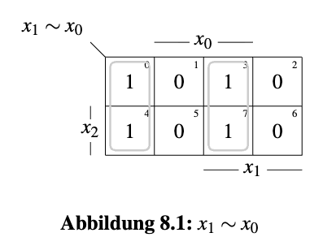
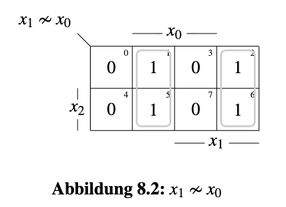
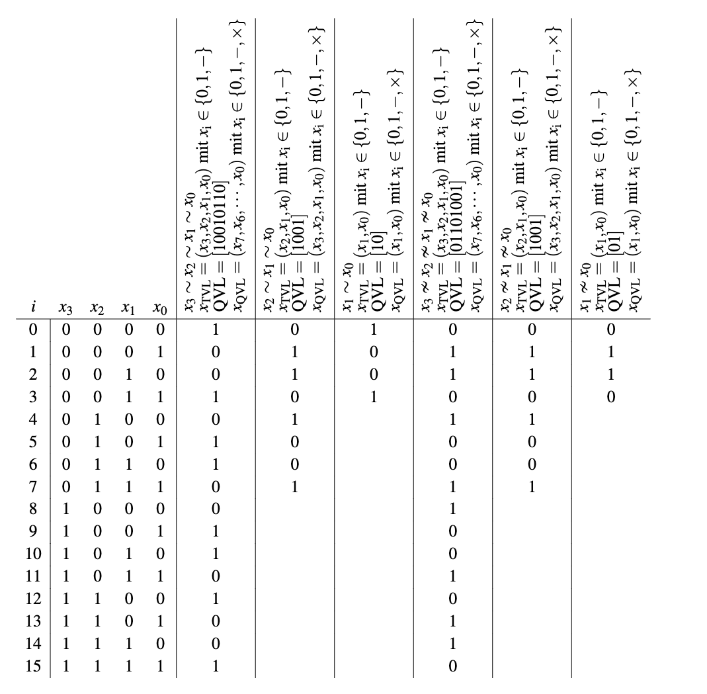
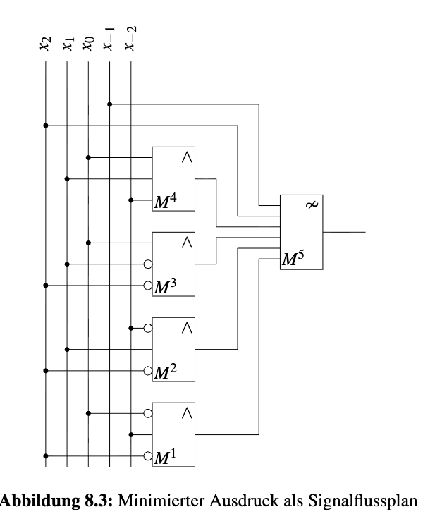

## Aufgabe 8.1: Äquivalenz, Antivalenz, TVL, QVL, KV-Diagramm
---

### a) DNF und KNF von $x1 \sim x0$

Die Äquivalenz $\sim$ (XNOR, $\odot$) ist genau dann 1, wenn beide Variablen denselben Wert haben.

**DNF**:
$$x_1 \sim x_0 = x_1x_0 \vee \overline{x_1} \ \overline{x_0}$$

**KNF**:
$$x_1 \sim x_0 = (x_1 \vee \overline{x_0}) \land (\overline{x_1} \vee x_0)$$

---

### b) KV-Diagramm mit x = (x2, x1, x0)

Da die Funktion nicht von $x_2$ abhängt, ist das Muster in beiden Zeilen ($x_2=0$ und $x_2=1$) identisch.

---

### c) TVL-Darstellung

$$x_1 \sim x_0 = [-\,1\,1]_{TVL} \vee [-\,0\,0]_{TVL}$$

---

### d) Indexmengendarstellung (IM)

$$\langle x_1\sim x_0\rangle = \langle x_1 x_0\rangle \cup \langle \overline{x_1}\,\overline{x_0}\rangle = \{3,7\} \cup \{0,4\} = \{0,3,4,7\} = I^1$$

Die Indexmenge $I^1$ enthält einfach alle Minterm-Nummern, für die die Funktion den Wert 1 annimmt. 

---

## e) QVL-Darstellung

$$AA = \{0,3,4,7\}_{IM} = [1010]_{QVL}$$

- $\{0\} \to [\times\times\times 0]$
- $\{3\} \to [\times\times 1\times]$
- $\{4\} \to [\times 0\times\times]$
- $\{7\} \to [1 \times\times\times]$

Da für jede Minterm genau ein Eintrag vorhanden ist, lassen sich die vier Teilergebnisse überlagern zu $[1010]_{QVL}$.

---

## f) Inversion mit 1 $\nsim$

Die Antivalenz $\nsim$ (XOR, $\oplus$) ist genau dann 1, wenn beide Variablen keinen selben Wert haben.

$$1 \nsim A = \overline{A}$$  

$$1 \nsim (x_1 \sim x_0) = \overline {x_1 \sim x_0} = x_1 \nsim x_0$$

Da der Komplementär (die Negation) von Äquivalenz $\sim$ gerade Antivalenz $\nsim$ ist, ergibt sich $x_1 \nsim x_0$.

---

## g) Inversion mit $0 \sim$

Die Äquivalenz $\sim$ (XNOR, $\odot$) ist genau dann 1, wenn beide Variablen denselben Wert haben.

$$0 \sim A = \overline{A}$$ 

$$0 \sim (x_1 \sim x_0) = \overline{x_1 \sim x_0} = x_1 \nsim x_0$$

---

### h) DNF, KNF und KV-Diagramm von $x1 \nsim x0$

**DNF:**
$$x_1 \nsim x_0 = x_1\,\overline{x_0} \vee \overline{x_1}\,x_0$$

**KNF:**
$$x_1 \nsim x_0 = (x_1 \vee x_0) \land (\overline{x_1}\vee \overline{x_0})$$

**KV-Diagramm:**

---

## i) IM und QVL von $x1 \nsim x0$

$$AA = \{1,2,5,6\}_{IM} = [0101]_{QVL}$$

Analog wie in e):

- $\{1\} \to [\times\times\times 1]$
- $\{2\} \to [\times\times 0\times]$
- $\{5\} \to [\times 1\times\times]$
- $\{6\} \to [0 \times\times\times]$

Überlagerung ergibt $[0101]_{QVL}$.

---

## j) Vergleich der QVL

$$x_1 \sim x_0 = [1010]_{QVL} \quad\text{vs.}\quad x_1 \nsim x_0 = [0101]_{QVL}$$

+ Beide QVL-Ausdurck sind stellenweise exakt komplementär. 
+ Die Negation einer Funktion entspricht in dieser QVL-Darstellung der stellenweisen Invertierung.

---

## Aufgabe 8.2: [Sudoku](https://sudoku.com/)

**Äquivalenzketten ($\sim$):**
- $x_1 \sim x_0$ (2 Variablen)
- $x_2 \sim x_1 \sim x_0$ (3 Variablen)
- $x_3 \sim x_2 \sim x_1 \sim x_0$ (4 Variablen)

**Antivalenzketten ($\nsim$):**
- $x_1 \nsim x_0$
- $x_2 \nsim x_1 \nsim x_0$
- $x_3 \nsim x_2 \nsim x_1 \nsim x_0$

### Der entscheidende Trick: algebraische Zusammenhänge nutzen

Statt jede Funktion einzeln berechnen, lassen sich zwei algebraische Identitäten ausnutzen, mit denen sich große Teile der Tabelle "automatisch" ergeben.

**Verkettung von $\sim$ entspricht $\nsim$ (mit Vorzeichenwechsel je nach Parität)**

- **Gerade Anzahl von Variablen** (z.B. 2er-Kette): $\sim$-Kette ist die **stellenweise Negation** der $\nsim$-Kette.
  $$x_1 \sim x_0 = [10]_{QVL}, \qquad x_1 \nsim x_0 = [01]_{QVL}$$

- **Ungerade Anzahl von Variablen** (z. B. 3er-Kette): $\sim$-Kette und $\nsim$-Kette sind **identisch**.
  $$x_2 \sim x_1 \sim x_0 = x_2 \nsim x_1 \nsim x_0 \quad\Rightarrow\quad \text{beide QVL} = [1001]$$

| $i$ | $x_2$ | $x_1$ | $x_0$ | $x_1\sim x_0$ | $x_1 \nsim x_0$ | $x_2\sim (x_1\sim x_0) $ | $x_2\nsim (x_1\nsim x_0)$ |
|---|---|---|---|---|---|---|---|
| 0 | 0 | 0 | 0 | 1 | 0 | $0$ | $0$ |
| 1 | 0 | 0 | 1 | 0 | 1 | $1$ | $1$ |
| 2 | 0 | 1 | 0 | 0 | 1 | $1$ | $1$ |
| 3 | 0 | 1 | 1 | 1 | 0 | $0$ | $0$ |
| 4 | 1 | 0 | 0 | 1 | 0 | $1$ | $1$ |
| 5 | 1 | 0 | 1 | 0 | 1 | $0$ | $0$ |
| 6 | 1 | 1 | 0 | 0 | 1 | $0$ | $0$ |
| 7 | 1 | 1 | 1 | 1 | 0 | $1$ | $1$ |

$$0 \sim A = \overline{A}; 1 \sim A = A$$ 
$$1 \nsim A = \overline{A}; 0 \nsim A = A$$

### Vorgehen zum Ausfüllen der Tabelle

1. Von links Spalte nach rechts ausfüllen
2. Die 2-er Ketten direkt brechnen
3. Die 3/4-er Ketten direkt ablesen mit:

   $$0 \sim A = \overline{A}; 1 \sim A = A$$ 
   $$1 \nsim A = \overline{A}; 0 \nsim A = A$$

4. Gerade Anzahl von Variablen in Kette $\to$ stellenweise Negation
5. Ungerade Anzahl von Variablen in Kette $\to$ identisch

---

## Aufgabe 8.3: Entwurf einer generischen multifunktionalen Schaltung 

$$\bigvee_{x_i\in x} x_i \;=\; \bigoplus_{j=1}^{|x|}\; \Biggl(\bigoplus_{x'\in\binom{x}{j}}\;\bigwedge_{x_i\in x'} x_i \Biggr)$$

**$x$:**

+ $x = (x_{n-1},\dots,x_1,x_0)$ ist eine Menge von $n$ booleschen Variablen. 
+ $|x|=n$ gibt die Anzahl dieser Variablen an.

**$\bigvee_{x_i\in x} x_i$:**

+ Oder-Verknüfung:
$$x_0 \vee x_1 \vee \dots \vee x_{n-1}$$

**$\bigoplus_{j=1}^{|x|}$:**

+ Eine äußere XOR-Summation, wobei $j$ von 1 bis $n=|x|$ läuft.

+ $j$ steht für die Größe der Teilmenge. Wir behandeln zunächst alle Teilmengen der Größe 1, dann alle der Größe 2, … bis hin zur Größe $n$ (also $x$ selbst). 

+ Die Ergebnisse aller $n$ Gruppen werden am Ende per XOR zusammengefasst.

**$\binom{x}{j}$ und $\bigoplus_{x'\in\binom{x}{j}}$:**

+ $\binom{x}{j}$ bezeichnet alle Teilmengen von $x$ mit genau $j$ Elementen 

+ Beispiel: $x=(x_2,x_1,x_0)$, $j=2$:
$$\binom{x}{2} = \big\{\{x_2,x_1\},\ \{x_2,x_0\},\ \{x_1,x_0\}\big\} \quad (\text{insgesamt }\binom{3}{2}=3\text{ Teilmengen})$$

+ $\bigoplus_{x'\in\binom{x}{j}}$ bedeutet: Für jede dieser Teilmengen $x'$ wird ein Wert berechnet, und alle diese Werte werden anschließend per XOR verknüpft.

**$\bigwedge_{x_i\in x'} x_i$:**

+ Für eine konkrete Teilmenge $x'$ (z. B. $x'=\{x_2,x_1\}$) werden alle darin enthaltenen Variablen per UND verknüpft:
$$\bigwedge_{x_i\in x'} x_i = x_2 \wedge x_1 = x_2x_1$$

### Gesamtbedeutung:

> **Alle nichtleeren Teilmengen von $x$ aufzählen** (insgesamt $2^n-1$), für jede Teilmenge das UND ihrer Elemente bilden, und anschließend alle $2^n-1$ UND-Ergebnisse per XOR verknüpfen.

#### Beispiel für n=2

Sei $x=(x_1,x_0)$, $n=2$, Links: $x_1\vee x_0$.

Alle nichtleeren Teilmengen (insgesamt $2^2-1=3$):

| $j$ (Größe) | Teilmenge $x'$ | UND-Ergebnis $\bigwedge_{x_i\in x'}x_i$ |
|---|---|---|
| 1 | $\{x_1\}$ | $x_1$ |
| 1 | $\{x_0\}$ | $x_0$ |
| 2 | $\{x_1,x_0\}$ | $x_1x_0$ |

$\to $ Rechte Seite $= x_1 \oplus x_0 \oplus x_1x_0$

**Überprüfung die Wertgleichkeit:**

| $x_1$ | $x_0$ | $x_1\vee x_0$ | $x_1\oplus x_0\oplus x_1x_0$ |
|---|---|---|---|
| 0 | 0 | 0 | $0\oplus0\oplus0=0$ |
| 0 | 1 | 1 | $0\oplus1\oplus0=1$ |
| 1 | 0 | 1 | $1\oplus0\oplus0=1$ |
| 1 | 1 | 1 | $1\oplus1\oplus1=1$ |

### Grundidee

Mit zwei zusätzlichen Steuersignalen $x_{-1}$ und $x_{-2}$ lässt sich daraus eine generische Schaltung bauen, die wahlweise OR, AND, NOR oder NAND realisiert:

$$AA = \left(\bigoplus_{j=1}^{|x|}\;\bigoplus_{x'\in\binom{x}{j}}\;\bigwedge_{x_i\in x'} (x_i \oplus x_{-2})\right) \oplus x_{-1}$$

**Bedeutung von $x_{-1}$ und $x_{-2}$**

| $x_{-1}$ | $x_{-2}$ | Funktion |
|---|---|---|
| 0 | 0 | $\bigvee x_i$ (OR) |
| 0 | 1 | $\bigvee \overline{x_i}$ = $\overline{\bigwedge x_i}$ (NAND) |
| 1 | 0 | $\overline{\bigvee x_i}$ (NOR) |
| 1 | 1 | $\overline{\bigvee \overline{x_i}} = \bigwedge x_i$ (AND) |

Damit ist die Schaltung generisch: dieselbe Hardware realisiert je nach Belegung von $x_{-1},x_{-2}$ vier verschiedene logische Funktionen.

---

### b) ANF(Antivalenzform) für $x=(x_2,\overline{x_1},x_0)$ (n=3)

Mit $n=3$ gibt es $2^3-1=7$ Teilprodukte: 3 einzelne Literale ($j=1$), 3 Paarprodukte ($j=2$), 1 Tripelprodukt ($j=3$):

$$AA = x_{-1} \oplus (x_0\oplus x_{-2}) \oplus ( \overline{x_1} \oplus x_{-2}) \oplus (x_2\oplus x_{-2})$$
$$\oplus\, \big[(x_0\oplus x_{-2})\wedge(\overline{x_1}\oplus x_{-2})\big] \oplus \big[(x_0\oplus x_{-2})\wedge(x_2\oplus x_{-2})\big] \oplus \big[(\overline{x_1}\oplus x_{-2})\wedge(x_2\oplus x_{-2})\big]$$
$$\oplus\, \big[(x_0\oplus x_{-2})\wedge(\overline{x_1}\oplus x_{-2})\wedge(x_2\oplus x_{-2})\big]$$

#### Zusatz: Minimierung

Mit XOR-Absorptionsregeln (z. B. **$a\oplus ab = a\overline{b}$, $a\oplus a = 0$**)

bekommen wir die vereinfachte Gleichung:
$$AA = x_{-1} \oplus x_2 \oplus x_0x_1\overline{x_2} \oplus \overline{x_{-2}} \ \overline{x_1} \  \overline{x_2} \oplus x_0\overline{x_1}x_{-2} \oplus \overline{x_0}x_{-2}\overline{x_2}$$

**Struktur:**

---

## Aufgabe 8.4: Komposition 

Gegeben: $f(x) = x_0 \overline{x_1} \vee x_2$

Gesucht: die Ausdrücke $A$, $B$, $C$ in der Formel für das Differential von $f$:
$$df = A dx_2\,dx_0 \;\oplus \; B \overline{dx_2}\,dx_0 \;\oplus \; C dx_2\, \overline{dx_0}$$

**Bedeutung der Formel**

$dx_0,dx_2\in\{0,1\}$ geben an, ob sich $x_0$ bzw. $x_2$ ändert (1 = ändert sich, 0 = bleibt gleich). Die Formel sagt also:

- Ändert sich nur $x_0$ ($dx_0=1, dx_2=0$) $\to df = B$
- Ändert sich nur $x_2$ ($dx_2=1, dx_0=0$) $\to df = C$
- Ändern sich beide ($dx_0=dx_2=1$) $\to df = A$

Hierbei sind $f_{x_i}$ die Booleschen Ableitungen (Differenzen): $f_{x_i} = f|_{x_i=0} \oplus f|_{x_i=1}$.
  - Da in $\{0,1\}$ nur zwei Zustände existieren, ist Differenz genau: $$f_{x_i} = f|_{x_i=1} - f|_{x_i=0}$$
  - Aber in Modulo-2-Arithmetik gilt: Subtraktion = Addition = XOR. Daher:
   $$\boxed{f_{x_i} = f\big|_{x_i=0} \oplus f\big|_{x_i=1}}$$

---

**Berechnung von B (= $f_{x_0}$)**

$$f|_{x_0=0} = x_2, \qquad f|_{x_0=1} = \overline{x_1}\vee x_2$$
$$B = f_{x_0} = x_2 \oplus (\overline{x_1}\vee x_2)$$

Mit $\overline{x_1}\vee x_2 = \overline{x_1}\oplus x_2\oplus \overline{x_1}x_2$ (vgl. Aufgabe 8.3):
$$B = x_2 \oplus \overline{x_1}\oplus x_2\oplus \overline{x_1}x_2 = \cancel{x_2} \oplus \overline{x_1}\oplus \cancel{x_2}\oplus \overline{x_1}x_2 \\ = \overline{x_1} \, \overline{x_2}$$

$$\boxed{B = \overline{x_1} \wedge \overline{x_2}}$$

---

**Berechnung von C (= $f_{x_2}$)**

$$f|_{x_2=0} = x_0\overline{x_1}, \qquad f|_{x_2=1} = 1$$
$$C = f_{x_2} = x_0\overline{x_1} \oplus 1 = \overline{x_0 \overline{x_1}} = \overline{x_0} \lor x_1$$

$$\boxed{C = \overline{x_0} \lor x_1}$$

---

**Berechnung von A (= $f_{x_0x_2}\oplus f_{x_0}\oplus f_{x_2}$)**

Zuerst die gemischte Ableitung $f_{x_0x_2}$ (Ableitung von $B=f_{x_0}$ nach $x_2$):
$$f_{x_0x_2} = B|_{x_2=0}\oplus B|_{x_2=1} = (\overline{x_1}\cdot1)\oplus(\overline{x_1}\cdot0) = \overline{x_1}$$

Damit:
$$A = f_{x_0x_2}\oplus f_{x_2}\oplus f_{x_0} = \overline{x_1} \oplus (\overline{x_0} \lor x_1) \oplus \overline{x_1} \, \overline{x_2}$$

Mit $\overline{x_0}\vee x_1 = \overline{x_0}\oplus x_1\oplus \overline{x_0}x_1$ (vgl. Aufgabe 8.3):

$$A = \overline{x_1} \oplus \overline{x_0}\oplus x_1\oplus \overline{x_0}x_1 \oplus \overline{x_1} \, \overline{x_2} 
\\ = \overline{x_1} \oplus \overline{x_0}\oplus x_0x_1 \oplus \overline{x_1} \, \overline{x_2} 
\\ = \overline{x_0}\oplus x_0x_1 \oplus \overline{x_1} x_2
\\ = 1 \oplus x_0 \oplus x_0x_1 \oplus \overline{x_1} x_2
\\ = 1 \oplus x_0\overline{x_1} \oplus \overline{x_1} x_2
\\ = 1 \oplus \overline{x_1}(\overline{x_0} \oplus \overline{x_2})
\\ = \overline{\overline{x_1}(\overline{x_0} \oplus \overline{x_2})}
\\ = x_1 \lor (\overline{x_0} \oplus \overline{x_2}) 
\\ = x_1 \lor x_0 x_2 \lor \overline{x_0} \, \overline{x_2}

$$

$$\boxed{A = x_1 \vee x_0x_2\vee\overline{x_0}\,\overline{x_2}}$$

---

## KV-Diagramme und 1-/0-Mengen

Sieh Schwarztafel oder Musterlösung

**Hinweise**
> 1-Mengen von A,B,C erhalten die Indizes, bei denen $f$ von 0 auf 1 umgekehrt wird.
> 0-Mengen von A,B,C erhalten die Indizes, bei denen $f$ von 1 auf 0 umgekehrt wird.

---

