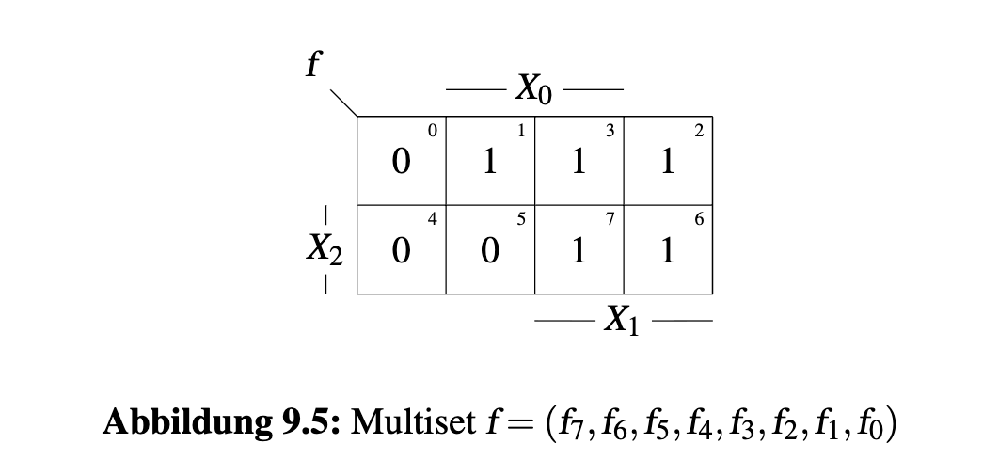

## Aufgabe 9.1: Transitions & Hazards

**Funktion der Schaltung:**

$$f(x) = \bar{x}_2 x_0 \vee x_1$$

Sein KV-Diagramm:

---

### T1. Alle Transitions bestimmen

Die partiellen Ableitungen werden genutzt:

$$F_{x_i} = \frac{\partial f}{\partial x_i} = f\Big|_{x_i=0} \oplus f\Big|_{x_i=1}$$

Eine Transition existiert genau dort, wo $F_{x_i} = 1$.

> $F_{x_i}$: $x_i\updownarrow \ \Longrightarrow f(x) \updownarrow $

---

**Berechnung von $F_{x_0}:$**

$$F_{x_0} = (\bar{x}_2 \cdot 0 \vee x_1) \oplus (\bar{x}_2 \cdot 1 \vee x_1)$$

$$= x_1 \oplus (\bar{x}_2 \vee x_1) = \bar{x}_2 \bar{x}_1$$

>Hinweis: $\bar{x}_2 \vee x_1 = \bar{x}_2 \oplus x_1 \oplus \bar{x}_2x_1$

Bedingung: $x_2 = 0,\ x_1 = 0$

$$\Rightarrow \text{Transition: } \{1\bar{0}\}_{\text{uu(und umgekehrt)}}$$

> Transistion: $x_2x_1x_0: 001 \rightleftharpoons 000 \Longrightarrow y: 1 \rightleftharpoons 0 $

---

**Berechnung von $F_{x_1}:$**

$$F_{x_1} = (\bar{x}_2 x_0) \oplus (\bar{x}_2 x_0 \vee 1) = \overline{\bar{x}_2 x_0} = x_2 \vee \bar{x}_0$$

Bedingung: $x_2 = 1$ oder $x_0 = 0$

$$\Rightarrow \text{Transition: } \{2\bar{0}, 6\bar{4}, 7\bar{5}\}_{uu}$$

> Transistion: $x_2x_1x_0: 010 \rightleftharpoons 000 \Longrightarrow y: 1 \rightleftharpoons 0 $
> Transistion: $x_2x_1x_0: 110 \rightleftharpoons 100 \Longrightarrow y: 1 \rightleftharpoons 0 $
> Transistion: $x_2x_1x_0: 111 \rightleftharpoons 101 \Longrightarrow y: 1 \rightleftharpoons 0 $

---

**Berechnung von $F_{x_2}:$**

$$F_{x_2} = (x_0 \vee x_1) \oplus (x_1) = x_0 \bar{x}_1$$

>Hinweis: $x_0 \vee x_1 = x_0 \oplus x_1 \oplus x_0x_1$

Bedingung: $x_0 = 1,\ x_1 = 0$

$$\Rightarrow \text{Transition: } \{1\bar{5}\}_{uu} $$

> Transistion: $x_2x_1x_0: 001 \rightleftharpoons 101 \Longrightarrow y: 1 \rightleftharpoons 0 $

---

**Berechnung von $F_{x_1 x_0}:$**

$$F_{x_1 x_0} =  \frac{\partial^2 f}{\partial x_1 \partial x_0}(F_{x_0})= \frac{\partial}{\partial x_1}(F_{x_0}) = \frac{\partial}{\partial x_1}(\bar{x}_2 \bar{x}_1) = \bar{x}_2$$

Bedingung: $x_2 = 0$

$$\Rightarrow \text{Transition: } \{1\bar{0}2\}_{uu}$$

> Transistion: $x_2x_1x_0: 001 \rightleftharpoons 000 \rightleftharpoons 010 \Longrightarrow y: 1 \rightleftharpoons 0 \rightleftharpoons 1 $
> Statischer Harzard

---

**Berechnung von $F_{x_0 x_1}:$**

$$F_{x_0 x_1} = \frac{\partial}{\partial x_0}(F_{x_1}) = \frac{\partial}{\partial x_0}( x_2 \vee \bar{x}_0) = \bar{x}_2$$

Bedingung: $x_2 = 0$

$$\Rightarrow \text{Transition: } \{1\bar{0}2\}_{uu}$$

> $F_{x_0 x_1} = F_{x_1 x_0}$
> Statischer Harzard

---

**Berechnung von $F_{x_2 x_1}:$** 

$$F_{x_2 x_1} = \frac{\partial}{\partial x_2}(F_{x_1}) =\frac{\partial}{\partial x_2}(x_2 \vee \bar{x}_0) = x_0$$

Bedingung: $x_0 = 1$

$$\Rightarrow \text{Transition: } \{1\bar{5}7\}_{uu}$$

> Transistion: $x_2x_1x_0: 001 \rightleftharpoons 101 \rightleftharpoons 111 \Longrightarrow y: 1 \rightleftharpoons 0 \rightleftharpoons 1 $
> $F_{x_1 x_2} = F_{x_2 x_1}$
> Statischer Harzard

---

**Berechnung von $F_{x_0 x_2}:$** 

$$F_{x_0 x_2} = \frac{\partial}{\partial x_0}(x_0 \bar{x}_1) = \bar{x}_1$$

Bedingung: $x_1 = 0$

$$\Rightarrow \text{Transition: } \{\bar{0}1\bar{5}\}_{uu}$$

> Transistion: $x_2x_1x_0: 100 \rightleftharpoons 101 \rightleftharpoons 101 \Longrightarrow y: 0 \rightleftharpoons 1 \rightleftharpoons 0 $
> $F_{x_2 x_0} = F_{x_0 x_2}$
> Statischer Harzard

---

**Berechnung von $F_{x_0x_1x_2}:$** 
$$F_{x_0 x_1 x_2} = \frac{\partial}{\partial x_0}(F_{x_1x_2})= 1$$

$$\Rightarrow \text{Transitions: } \{7\bar{5}1\bar{0}, 2\bar{0}1\bar{5}\}_{uu}$$

> Transistion: $x_2x_1x_0: 111 \rightleftharpoons 101 \rightleftharpoons 001 \rightleftharpoons 000 \Longrightarrow y: 1 \rightleftharpoons 0 \rightleftharpoons 1 \rightleftharpoons 0 $
> Transistion: $x_2x_1x_0: 010 \rightleftharpoons 000 \rightleftharpoons 001 \rightleftharpoons 101 \Longrightarrow y: 1 \rightleftharpoons 0 \rightleftharpoons 1 \rightleftharpoons 0 $
> Dynamischer Harzard

---

**Zusammenfassung aller einmaligen Transitions:**

$$\boxed{T = \{1\bar{0},\ 1\bar{5},\ 2\bar{0},\ 6\bar{4}, 7\bar{5}\}_{uu}}$$

---

### T2: Differential $df$

**Definition $df$**

$$df = f(x) \oplus f(x \oplus dx)$$

Das Differential beschreibt, bei welchen Eingangsbelegungen $x$ und Eingangsänderung $dx$ eine Ausgangsänderung $df$ auftritt.

> $dx = (dx_2, dx_1, dx_0)$ ist der Richtungsvektor der Veränderung. 
> $dx_i = 1$ bedeutet, dass sich die entsprechende Variable geändert hat.

**Berechnung**

$$df = (\bar{x}_2 x_0 \vee x_1) \oplus \big((\overline{x_2 \oplus dx_2})(x_0 \oplus dx_0) \vee (x_1 \oplus dx_1)\big)$$

Nach Vereinfachen (sieh Musterlösung) ergeben sich die 7 disjunkten Elementarkonjunktionen:

$$df = \underbrace{\bar{x}_2 \bar{x}_1dx_0}_{1}
\oplus \underbrace{(x_2 x_0 \oplus \bar{x}_0)dx_1}_{2}
\oplus \underbrace{\bar{x}_1 x_0 dx_2}_{3}
\oplus \underbrace{\bar{x}_1 dx_2 dx_0}_{4}
\oplus \underbrace{\bar{x}_2 dx_1 dx_0}_{5}
\oplus \underbrace{x_0 dx_2 dx_1}_{6}
\oplus \underbrace{dx_2 dx_1 dx_0}_{7}$$

---

**Bedeutung der Terme**

| Term | Beschreibung |
|---|---|
| $\bar{x}_2 \bar{x}_1dx_0$ | Änderung nur $x_0$, wirkt wenn $x_2=0, x_1=0$ |
| $(x_2 x_0 \oplus \bar{x}_0)dx_1$ | Änderung nur $x_1$, wirkt wenn $x_2=1$ oder $x_0=0$ |
| $\bar{x}_1 x_0 dx_2$ | Änderung nur $x_2$, wirkt wenn $x_1=0, x_0=1$ |
| $\bar{x}_1 dx_2 dx_0$ | Änderung $x_2$ und $x_0$, wirkt wenn $x_1=0$ |
| $\bar{x}_2 dx_1 dx_0$ | Änderung $x_1$ und $x_0$, wirkt wenn $x_2=0$ |
| $x_0 dx_2 dx_1$ | Änderung $x_2$ und $x_1$, wirkt wenn $x_0=1$ |
| $dx_2 dx_1 dx_0$ | Änderung $x_2$, $x_1$ und $x_0$, wirkt immer |

---

**Die Elementarkonjunktionen in KV-Diagramm eintragen:**

Sieh Musterlösung

> Ungerade Anzahl von Terme $\to df = 1$ (gelb Block), Gerade Anzahl von Terme $\to df = 0$ (leer Block)
> Gelbe Überdeckung hat gleich Fläche wie Blau Überdeckung
> In Blau Überdeckung, Terme mit $dx_i$ nummerieren und mit $x_i$ darstellen
> Z.B., Blau Term 1 mit $dx_2dx_1dx_0$ nummerieren und mit $\bar{x}_1\bar{x}_0 \oplus \bar{x}_2x_1 \oplus x_2x_0$ darstellen

---

### T3: Statische und dynamische Hazards

**Methode: Schlüsselresolvierung**

Für zwei Transitions $c_1$ und $c_2$ gilt:

$$r(c_1, c_2) = c_1 \wedge c_2 \iff \exists\, l : l \in c_1 \wedge l \in c_2$$

Zwei Transitions lassen sich resolvieren, wenn sie sich in genau einem Literal $l$ existieren.

**aller einmaligen Transitions:**

$$\boxed{T = \{1\bar{0},\ 1\bar{5},\ 2\bar{0},\ 6\bar{4}, 7\bar{5}\}_{uu}}$$

**Statische Hazards (Resolutionen erster Ordnung)**

| $c_1$ | $c_2$ | Resolution $r(c_1, c_2)$ | Typ |
|---|---|---|---|
| $\{1\bar{0}\}$ | $\{1\bar{5}\}$ | $\{\bar{0}1\bar{5}\}$ | statischer Hazard |
| $\{1\bar{0}\}$ | $\{2\bar{0}\}$ | $\{1\bar{0}2\}$ | statischer Hazard |
| $\{1\bar{5}\}$ | $\{7\bar{5}\}$ | $\{1\bar{5}7\}$ | statischer Hazard |

**Dynamische Hazards (Resolutionen zweiter Ordnung)**

| $c_1$ | $c_2$ | Resolution $r(c_1, c_2)$ | Typ |
|---|---|---|---|
| $\{\bar{0}1\bar{5}\}$ | $\{1\bar{0}2\}$| $\{2\bar{0}1\bar{5}\}$ | dynamischer Hazard |
| $\{\bar{0}1\bar{5}\}$ | $\{1\bar{5}7\}$ | $\{751\bar{0}\}$ | dynamischer Hazard |

**Gesamtergebnis**

$$R(F) = \{\underbrace{1\bar{0},\ 1\bar{5},\ 2\bar{0},\ 6\bar{4}, 7\bar{5}}_{\text{Transitions}},  \underbrace{\bar{0}1\bar{5},\ 1\bar{0}2,\ 1\bar{5}7}_{\text{statische Hazards}}, \underbrace{2\bar{0}1\bar{5},\ 751\bar{0}}_{\text{dynamische Hazards}}\}$$

> Oder direkt von Teilaufgabe 1 auslesen!

---

## Aufgabe 9.2: ULM-3 — Universelles Logik-Modul

**Grundidee des ULM-k**

Ein **ULM-k (Universelles Logik-Modul-k)** ist ein programmierbarer Multiplexer, der jede beliebige Funktion mit $k$ Eingangsvariablen realisieren kann.

Die Grundstruktur trennt zwei Eingänge:
- **Adressvektor** $a$: wählt den aktiven Dateneingang aus
- **Programmiervektor** $d$: legt die zu realisierende Funktion fest

Für ein **ULM-k** mit $k$ Eingangsvariablen gilt:

$$|a| = k - 1 \qquad \text{(Länge des Adressvektors)}$$

$$|d| = 2^{k-1} \qquad \text{(Länge des Programmiervektors)}$$

---

### T1: 1-Menge von $y$

**Struktur des Multiplexers**

Der Adressvektor $a = (a_1, a_0)$ wählt genau einen der vier Dateneingänge aus:

| $a_1$ | $a_0$ | aktive Leitung |
|---|---|---|
| 0 | 0 | $d_0$ |
| 0 | 1 | $d_1$ |
| 1 | 0 | $d_2$ |
| 1 | 1 | $d_3$ |

**Ausdruck für die 1-Menge**

Jeder Dateneingang wird mit seinem zugehörigen Adress-Minterm konjugiert und anschließend disjungiert (KDNF):

$$\boxed{y = d_0 \bar{a}_1 \bar{a}_0 \vee d_1 \bar{a}_1 a_0 \vee d_2 a_1 \bar{a}_0 \vee d_3 a_1 a_0}$$

---

### T2: Realisierung aus NAND-Gattern

**Herleitung via De Morgan**

$$y = \overline{\overline{d_0 \bar{a}_1 \bar{a}_0} \cdot \overline{d_1 \bar{a}_1 a_0} \cdot \overline{d_2 a_1 \bar{a}_0} \cdot \overline{d_3 a_1 a_0}}$$

**Schaltungsstruktur**

Sieh Musterlösung

---

### T3: Parametrisiertes KV-Diagramm

**Achsen (Cantorsche Variablen):** 
  $a = (a_1, a_0)$ — definieren die KV-Koordinaten

**Zellenwerte (Quantorenvariablen / QV):** 
  $d_i$ — stehen als Parameter in den Zellen

$$\begin{array}{c|cc}
y & a_0 = 0 & a_0 = 1 \\\hline
a_1 = 0 & d_0 & d_1 \\
a_1 = 1 & d_2 & d_3
\end{array}$$

---

### T4: Allgemeine Vektorlängen für ULM-k

$$|a| = k - 1 \qquad \text{(Länge des Adressvektors)}$$

$$|d| = 2^{k-1} \qquad \text{(Länge des Programmiervektors)}$$

---

### T5: Parameter für ULM-3

Mit $k = 3$ ergibt sich:

$$|a| = 3 - 1 = 2 \quad \Rightarrow \quad a = (a_1, a_0)$$

$$|d| = 2^{3-1} = 4 \quad \Rightarrow \quad d = (d_3, d_2, d_1, d_0)$$

---

### T6: Anwendungsbeispiel

Gegeben:
$$y = x_2 \bar{x}_1 \vee \bar{x}_1 x_0 \vee \bar{x}_2 x_1 \bar{x}_0$$

**(a) Umformung in KDNF**

$$y = x_2 \bar{x}_1 x_0 \vee x_2 \bar{x}_1 \bar{x}_0 \vee x_2 \bar{x}_1 x_0  \vee \bar{x}_2 \bar{x}_1 x_0 \vee \bar{x}_2 x_1 \bar{x}_0$$

---

**(b) Definition der Adresseingänge**

Die beiden niederwertigen Variablen werden als Adresse gewählt:

$$a_1 = x_1, \qquad a_0 = x_0$$

Die verbleibende Variable $x_2$ wird als Parameter gewählt.

---

**(c) Gruppierung nach $a = (x_1, x_0)$**

Der y-Ausdruck wird nach den vier Adress-Minterms gruppiert:

| $(x_1, x_0)$ | enthaltene Minterme | $d_i$ |
|---|---|---|
| $\bar{x}_1 \bar{x}_0$ | $x_2\bar{x}_1 \bar{x}_0$ | $d_0 = x_2$ |
| $\bar{x}_1 x_0$ | $x_2 \bar{x}_1 x_0 \vee \bar{x}_2 \bar{x}_1 x_0 $ | $d_1 = x_2 \vee \bar{x}_2 = 1$ |
| $x_1 \bar{x}_0$ | $\bar{x}_2 x_1 \bar{x}_0$ | $d_2 = \bar{x}_2$ |
| $x_1 x_0$ | - | $d_3 = 0$ |

Damit ergibt sich:

$$y = (x_2)\bar{x}_1\bar{x}_0 \vee (1)\bar{x}_1 x_0 \vee (\bar{x}_2) x_1 \bar{x}_0 \vee (0) x_1 x_0$$

---

**(d) Parametrisiertes KV-Diagramm**

$$\begin{array}{c|cc}
& x_0 = 0 & x_0 = 1 \\\hline
x_1 = 0 & x_2 & 1 \\
x_1 = 1 & \bar{x}_2 & 0
\end{array}$$

---

**(e) Programmierter MUX vom Typ ULM-3**
**(f) Weitere KV-Diagramme**

Sieh Musterlösung

---

### T7: Allgemeine Programmierung

Bisher waren die $d_i$-Werte aus $\{0, 1, x_2, \bar{x}_2\}$. Die Frage lautet: Lässt sich dies systematisch verallgemeinern?

Jeder Dateneingang $d_i$ wird selbst als parametrisierte Funktion der dritten Variablen $x_2$ ausgedrückt:

$$d_i = p_{i1} x_2 \vee p_{i0} \bar{x}_2, \qquad p_{ij} \in \{0, 1\}$$

Die vier möglichen Kombinationen decken alle Fälle ab:

| $p_{i1}$ | $p_{i0}$ | $d_i$ |
|---|---|---|
| 0 | 0 | $0$ |
| 0 | 1 | $\bar{x}_2$ | $0$ |
| 1 | 0 | $x_2$ | $1$ |
| 1 | 1 | $1$ | $-$ |

Damit ist jede beliebige dreistellige Boolesche Funktion durch geeignete Wahl der $p_{ij} \in \{0,1\}$ realisierbar.

---

### T8: Bestimmung der $p_{ij}$ für Bild 9.4

Gegeben das parametrisierte KV-Diagramm:

$$\begin{array}{c|cc}
& x_0=0 & x_0=1 \\\hline
x_1=0 & x_2 & 1 \\
x_1=1 & \bar{x}_2 & 0
\end{array}$$

### Auslesen der $p_{ij}$-Werte

Jede Zelle liefert direkt die Koeffizienten für $d_i = p_{i1}x_2 \vee p_{i0}\bar{x}_2$:

| Zelle | $d_i$ | $p_{i1}$ | $p_{i0}$ | QVL |
|---|---|---|---|---|
| $d_0\ (x_1=0, x_0=0)$ | $x_2$ | 1 | 0 | $[1]$ |
| $d_1\ (x_1=0, x_0=1)$ | $1$ | 1 | 1 | $[-]$ |
| $d_2\ (x_1=1, x_0=0)$ | $\bar{x}_2$ | 0 | 1 | $[0]$ |
| $d_3\ (x_1=1, x_0=1)$ | $0$ | 0 | 0 | $[\times]$ |

Der vollständige Programmiervektor lautet (von $p_{31}p_{30}$ nach $p_{01}p_{00}$):

$$\boxed{p = [\times\ 0\ -\ 1]_{QVL}}$$

---

### T9: Kodierung in TVL
Ja, TVL2QV

---

### T10: TVL-Programmierung von Bild 9.4

**Gegeben:**
$$p = [\times\ 0\ -\ 1]_{QVL}$$

**Gesucht: t = ?**

Mit Codierungstabelle auslesen oder berechnen QVL nach TVL

$$t =
\begin{bmatrix}
0 & - & 1 \\
0 & 1  & - \\
1 & 0  & 0
\end{bmatrix}_{TVL}$$

---

### T11: Gesamtschaltungsstruktur

Die vollständige Schaltung des über TVL2QV einstellbaren ULM-3 gliedert sich in zwei Stufen:

**Stufe 1: TVL2QV-Dekoder**

Wandelt den dreistelligen TVL-Eingangsvektor $t = (t_2, t_1, t_0)$ in den achtstelligen Binärvektor der $p_{ij}$-Koeffizienten um:

$$t\ (3 \times 2\text{-kodiert}) \xrightarrow{\text{NAND-Logik}} (p_{31}, p_{30}, p_{21}, p_{20}, p_{11}, p_{10}, p_{01}, p_{00})$$

**Stufe 2: ULM-3 MUX**

Die $p_{ij}$-Paare steuern die Dateneingänge des MUX. Jeder Dateneingang wird durch ein 2-Eingang-NAND realisiert:

$$d_i = p_{i1} x_2 \vee p_{i0} \bar{x}_2 \quad \longrightarrow \quad \text{via NAND: } d_i = \overline{\overline{p_{i1} x_2} \cdot \overline{p_{i0} \bar{x}_2}}$$

**Gesamtstruktur**

Sieh Musterlösung

---