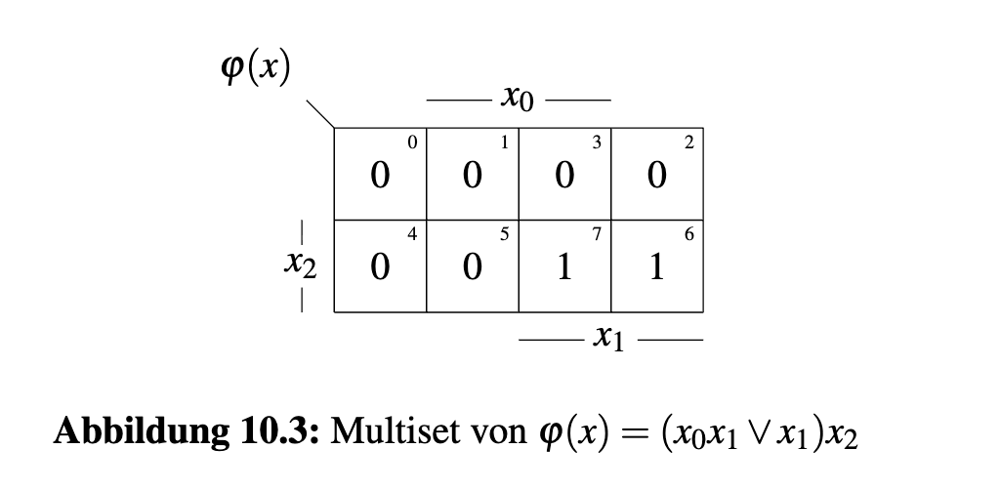
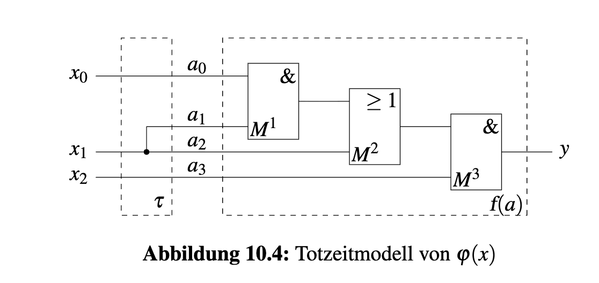
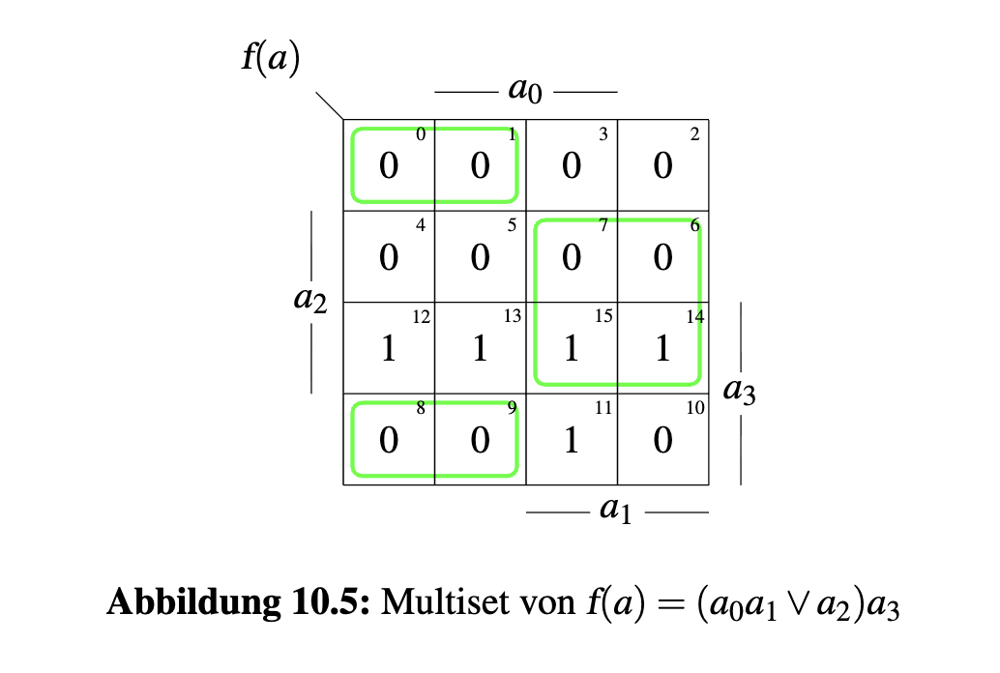
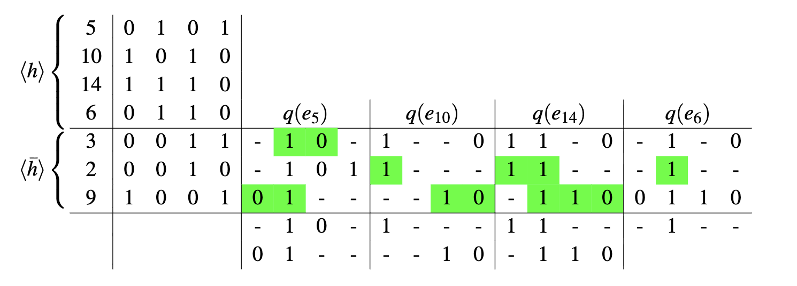
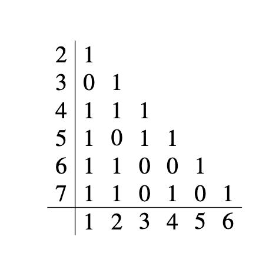
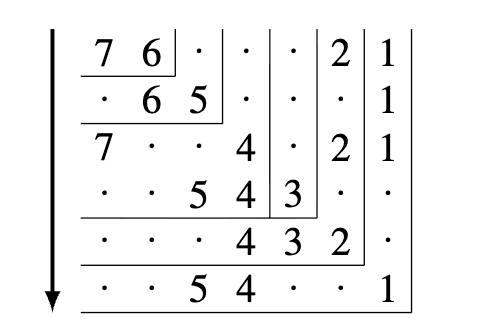
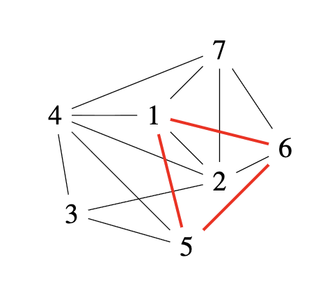
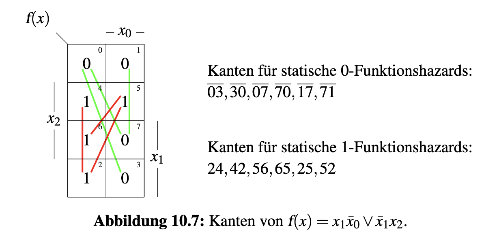

## Aufgabe 10.1 Totzeitmodell

#### a. SA und KV-Diagramm (Multiset)

Schaltung $\varphi(x)$ mit Kodierung $x = (x_2, x_1, x_0)$:

$$\varphi(x) = (x_0 x_1 \vee x_1)\, x_2$$

---

### b. Totzeitmodell

Das Totzeitmodell zerlegt die Schaltung in:

- **Verzögerungsanteil** $\tau$: alle Gatterlaufzeiten konzentriert am Ausgang
- **Logik-Anteil** $f(a)$: ideale, verzögerungsfreie Schaltung

**Variablen-Umkodierung**

Neue Kodierung $(a_3, (a_2, a_1), a_0) = (x_2, x_1, x_0)$, d.h.:

$$a_3 = x_2, \quad a_2 = x_1, \quad a_1 = x_1, \quad a_0 = x_0$$

$$\boxed{f(a) = (a_0 a_1 \vee a_2)\, a_3}$$

---
### c. Funktionsharzards von $f(a)$

**KV-Diagramm**

**Transitions $\langle \nsim_T \rangle$**

Alle benachbarten Paare $(i, j)$ mit $f(i) \neq f(j)$ und Hamming-Distanz 1:

$$\langle T \rangle = \{(\overline{10},11), (\overline{9},11), (\overline{3},11), (\overline{8},12), (\overline{4},12), (\overline{9},13), (\overline{5},13), (\overline{10},14),(\overline{6},14),(\overline{7},15)\}_{uu}$$

**Statische Funktionshazards $\langle \nsim_{sF} \rangle$**

mit Schlüsselresolvierung erster Ordnung:

$$\langle \nsim_{sF} \rangle = \{(\overline{10},11,\overline{9}),\,(\overline{10},11,\overline{3}),\,(\overline{9},11,\overline{3}),\,(\overline{8},12,\overline{4}),\,(11,\overline{9},13),\,(\overline{9},13,\overline{5}),\,(11,\overline{10}, 14),(\overline{10},14,\overline{6})\}_{uu}$$

**Dynamische Funktionshazards $\langle \nsim_{dF} \rangle$**

mit Schlüsselresolvierung zweiter Ordnung:

$$\langle \nsim_{dF} \rangle = \{(\overline{10},11,\overline{9}, 13),\, (\overline{9},11,\overline{10}, 14), \, (\overline{3},11,\overline{10},14),\,(\overline{3},11,\overline{9},13),\,(11,\overline{9},13,\overline{5}),\,(11,\overline{10},14,\overline{6})\}_{uu}$$

---

### d. Strukturhazards von $\varphi(x)$

$$\nsim_{S}(\varphi(x)) \leq \nsim_{F}(f(a))$$
$$\langle \nsim_{S}(\varphi(x)) \rangle \leq \langle \sim_{sF}(f(a)) \rangle \cup \langle \sim_{dF}(f(a)) \rangle$$

> Strukturharzards ist Teilmenge von Funktionsharzards

---

### e. Geschlossene Form $\nsim_{sF} = \overline{df}\delta f$

**$\nsim_{sF}(\varphi(x)):$**

$$\langle \nsim_{sF}(\varphi(x))\rangle = \{(\overline{2},6,\overline{4}), \, (\overline{3},7,\overline{5})\}_{uu}$$

| $i$ | $x_2$ | $x_1$ | $x_0$ | Richtung |
|--------|--------|--------|--------|----------|
| 2      | 0      | 1      | 0      | Start    |
| 4      | 1      | 0      | 0      | Ende     |
| 3      | 0      | 1      | 1      | Start    |
| 5      | 1      | 0      | 1      | Ende     |

> $x_2$ und $x_1$ ändern sich gleichzeitig, $x_2 \nsim x_1$ ist die aktive Bedingung:

$$\boxed{\nsim_{sF}(\varphi(x)) = (x_2 \nsim x_1)\, dx_2\, dx_1\, \overline{dx_0}}$$

---

**$\nsim_{sS}(\varphi(x)):$**

$$\langle \nsim_{sF}(f(a))\rangle = \{\underbrace{(\overline{7},15,11, \overline{9}), \, (\overline{7},15,13, \overline{9})}_{(\overline{2},6,\overline{4})}, \, \underbrace{(\overline{6},14, 12,\overline{8})}_{\overline{3},7,\overline{5}}\}_{uu}$$

| $i$ | $a_3$ | $a_2$ | $a_1$ | $a_0$ | Richtung |
|--------|--------|--------|-----|----|----------|
| 9      | 1      | 0      | 0   |  1 | Start    |
| 7      | 0      | 1      | 1   |  1 | Ende     |
| 8      | 1      | 0      | 0   |  0 | Start    |
| 6      | 0      | 1      | 1   |  0 | Ende     |

> $a_3 = x_2, (a_2, a_1) = x_1, a_0 = x_0$

$$\boxed{\nsim_{sS}(\varphi(x)) = (x_2 \nsim x_1)\, dx_2\, dx_1\, \overline{dx_0}}$$

> $\nsim_{sS} = \nsim_{sF}$ gilt nicht im Allgemeinen – in dieser Aufgabe ist es ein Sonderfall.

---

## Aufgabe 10.2 Zusammenhangsklassen

**Gegeben:**

$$X^1 = \langle h \rangle = [0101,\; 1010,\; 1110,\; 0110]$$
$$X^0 = \langle \bar{h} \rangle = [0011,\; 0010,\; 1001]$$

mit Variablenkodierung $(x_3, x_2, x_1, x_0)$.

Benennung der Elemente:

| Name   | Bitmuster | $x_3$ | $x_2$ | $x_1$ | $x_0$ |
|--------|-----------|--------|--------|--------|--------|
| $e_5$  | 0101      | 0      | 1      | 0      | 1      |
| $e_{10}$ | 1010    | 1      | 0      | 1      | 0      |
| $e_{14}$ | 1110    | 1      | 1      | 1      | 0      |
| $e_6$  | 0110      | 0      | 1      | 1      | 0      |
| $e_3$  | 0011      | 0      | 0      | 1      | 1      |
| $e_2$  | 0010      | 0      | 0      | 1      | 0      |
| $e_9$  | 1001      | 1      | 0      | 0      | 1      |

> Alle Paare $(e_i \in X^1,\; e_j \in X^0)$ sind unverträglich (EN: incompatible), da $X^1$ und $X^0$ disjunkt definiert sind (kein Element kann gleichzeitig 1 und 0 ergeben).

---

### a. Zusammenhangsklassen $q(e_i)$ berechnen

$$q(e_i) = \bigwedge_{k=i \sqcap \bar{j}} q_{ik}$$

mit $q_{ij} h_j = 0$

> Jede Klasse resolviert 
---

### b.1-Überdeckung von $h$

$$h = q(e_5) \vee q(e_{10}) \vee q(e_{14}) \vee q(e_6)$$
$$q(e_5) = (x_2 \vee \bar{x}_1) \wedge (\bar{x}_3 \vee x_2)$$
$$q(e_{10}) = x_3 \wedge (x_1 \vee \bar{x}_0)$$
$$q(e_{14}) = (x_3 \vee x_2) \wedge (x_2 \vee x_1 \vee \bar{x}_0)$$
$$q(e_{16}) = x_2$$

Mit BA vereinfachen:

$$\boxed{h = x_2 \vee x_3 \bar{x}_0 \vee \bar{x}_3 \bar{x}_1 \vee x_3 x_1}$$

$$h = \begin{bmatrix} - & 1 & - & - \end{bmatrix}
\vee
\begin{bmatrix} 1 & - & - & 0 \end{bmatrix}
\vee
\begin{bmatrix} 0 & - & 0 & - \end{bmatrix}
\vee
\begin{bmatrix} 1 & - & 1 & - \end{bmatrix}$$

> Die Zusammenhangsklasse $q(e_i)$ eines Elements beschreibt alle möglichen Primimplikanten, die $e_i$ überdecken, ohne ein Element aus $X^0$ einzuschließen.

---

## Aufgabe 10.3 Vertäglichkeitsklassen

Die Verträglichkeitsrelation ist gegeben durch die Nachbarschaftsliste:

| Element | Verträglich mit |
|---------|-----------------|
| 1       | {7, 6, 5, 4, 2} |
| 2       | {7, 6, 4, 3}    |
| 3       | {5, 4}          |
| 4       | {7, 5}          |
| 5       | {6}             |
| 6       | {7}             |

> Element 1 ist verträglich mit 7, 6, 5, 4 und 2. Die Relation ist symmetrisch, d.h. wenn $i \sim j$, dann auch $j \sim i$.

---

### a. Verträglichkeitstabelle aufbauen

Wir tragen alle Verträglichkeitspaare in eine Dreiecksmatrix ein.
Ein Eintrag **1** bedeutet verträglich ($i \sim j$), ein Eintrag **0** bedeutet unverträglich.

---

### b. Resolvierung 

Wir suchen alle **maximalen** Verträglichkeitsklassen, in denen **alle Paare verträglich** sind und die nicht mehr erweitert werden können.

> z.B. {7, 6, 4, 2, 1} zerlegt in {7, 6, 2, 1} und {7, 4, 2, 1}, weil 4 und 6 nicht vertäglich sind.
> z.B. {6, 5, 2, 1} zerlegt in {6, 2, 1} und {6, 5, 1}, {6, 2, 1} wird absorbiert.

---

### c. Struktur der Verträglichkeitsklassen

$$R^* = \{\{7, 6, 2, 1\}, \{7, 4, 2, 1\}, \{6, 5, 1\}, \{5, 4, 3\}, \{5, 4, 1\}, \{4, 3, 2\}\}$$

---

## Aufgabe 10.4 Funktions- und Strukturhazards

$$f(x) = x_1 \overline{x}_0 \vee \overline{x}_1 x_2 \qquad \text{mit } x = (x_2, x_1, x_0)$$

### a. Statische Funktionshazards ($\nsim_{sF}$) 

**Statische 0-Hazards**:

$$\langle \nsim_{sF0} \rangle = \{(\overline{0},2,\overline{3}), \, (\overline{0}, 4, 6,\overline{7}), \, (\overline{1},5,\overline{7})\}_{uu}$$

**Statische 1-Hazards**:

$$\langle \nsim_{sF1} \rangle = \{(2,\overline{0}, 4), \, (5,\overline{7}, 6), \, (2, \overline{3},\overline{7}, 5)\}_{uu}$$

---

### b. $\nsim_{sF}$ als Schaltalgebraischen Ausdruck (AA) 

Siehe Musterlösung

> Z.B. Für Terme $\overline{dx_2}dx_1dx_0(\overline{x}_2\overline{x}_1\overline{x}_0 \vee \overline{x}_2x_1x_0)$, $\overline{dx_2}dx_1dx_0$ bedeutet nur bei $x_1$ und $x_0$ gibt es Änderung, mit Anfangswert $\overline{x}_2\overline{x}_1\overline{x}_0 (000)$ und Endewerte $\overline{x}_2x_1x_0(011).$

---

### c. $\nsim_{sF}$ als TVL 

Siehe Musterlösung 

> Die TVL-Darstellung mit $(x_2, x_1, x_0, dx_2, dx_1, dx_0)$:

---

### d. Dynamische Funktionshazards ($\nsim_{dF}$) 

Siehe Musterlösung 

---

### e: Umkodierung zu $f(a)$

Mit $x_1 = (a_2, a_1)$:

$$a_3 = x_2, \quad (a_2, a_1) = x_1, \quad a_0 = x_0$$

Substitution in $f(x) = x_1 \overline{x}_0 \vee \overline{x}_1 x_2$:

$$\boxed{f(a) = a_2 \overline{a}_0 \vee \overline{a}_1 a_3}$$

Siehe Musterlösung Abb: 10.9 Totzeitmodell $f(a)$

---

### f. KV-Diagramm von $f(a)$

Siehe Musterlösung

---

### g: Statische Funktionshazards $\nsim_{sF(f(a))}$
Siehe Musterlösung 

> Wir suchen im KV-Diagramm von $f(a)$ alle Tupel $(A, B, \ldots, C)$ mit:
> - Benachbarte Übergänge (je Hamming-Distanz 1)
> - $f(A) = f(C)$ (gleicher Anfangs- und Endwert)
> - Mindestens **zwei Transitions** am Ausgang auf dem Pfad
> - Keine Variable ändert sich mehrfach

---

### h: Statische Strukturhazards $\nsim_{sS(f(x))}$
Siehe Musterlösung

---